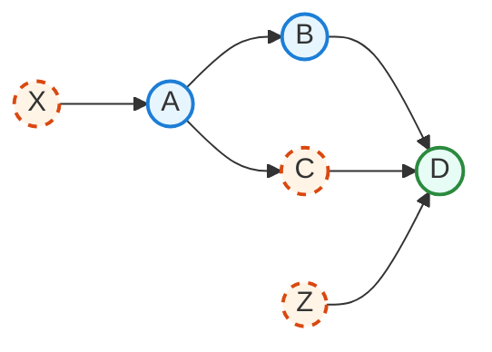
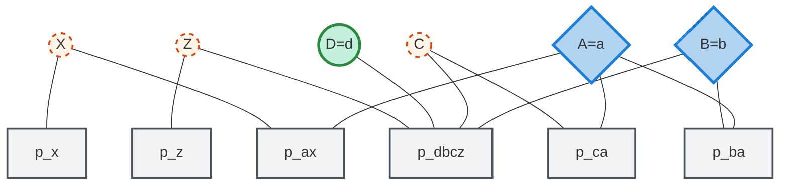
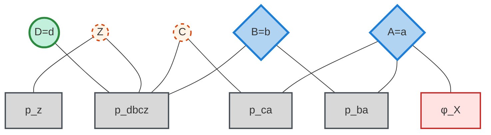

# Automatic Marginalization in Mixed Discrete-Continuous Models

## The Problem

Modern gradient-based inference methods require differentiable log-densities:

- HMC, NUTS, variational inference need smooth objectives 
- Discrete variables aren't differentiable
- Solution: marginalize out discrete variables exactly 
 
**Challenge**: How to do this efficiently?


## Example Model

Mixed BN: discrete $X,C,Z$; continuous $A,B$; observed $D$.




## BUGS Program

```r
model {
  # Discrete priors
  X ~ dcat(piX[])  # piX is length-|X|
  Z ~ dcat(piZ[])  # piZ is length-|Z|

  # Conditionals
  A ~ dnorm(muX[X], 1/pow(sigmaA,2))
  B ~ dnorm(A, 1/pow(sigmaB,2))

  # Logistic gate for C
  logit(pC) <- alpha0 + alpha1 * A
  pCvec[1] <- 1 - pC
  pCvec[2] <- pC
  C ~ dcat(pCvec[])

  # Likelihood
  D ~ dnorm(B + deltaC[C] + deltaZ[Z], 1/pow(sigmaD,2))
}
```


## Joint Probability

Following topological order $z, x, a, b, c, d$:

$$
\begin{aligned}
\log p(z, x, a, b, c, d) &= \log p(z) + \log p(x) + \log p(a \mid x) \\
&\quad + \log p(b \mid a) + \log p(c \mid a) \\
&\quad + \log p(d \mid b, c, z)
\end{aligned}
$$


## Marginalization Target

For gradient-based inference, marginalize out discrete variables:

$$
\begin{aligned}
\log p(a, b, d) = \log &\sum_{z \in \mathcal{Z}} \sum_{x \in \mathcal{X}} \Big[ p(z) \cdot p(x) \cdot p(a \mid x) \cdot p(b \mid a) \\
&\cdot \sum_{c \in \mathcal{C}} p(c \mid a) \cdot p(d \mid b, c, z) \Big]
\end{aligned}
$$

following the same topological order in the computation.


## Naive Enumeration

Full expansion reveals massive redundancy:

$$
\begin{aligned}
&p(z{=}1) \cdot p(x{=}1) \cdot p(a|x{=}1) \cdot p(b|a) \cdot p(c{=}1|a) \cdot p(d|b,c{=}1,z{=}1) \\
&p(z{=}1) \cdot p(x{=}1) \cdot p(a|x{=}1) \cdot p(b|a) \cdot p(c{=}2|a) \cdot p(d|b,c{=}2,z{=}1) \\
&p(z{=}1) \cdot p(x{=}2) \cdot p(a|x{=}2) \cdot p(b|a) \cdot p(c{=}1|a) \cdot p(d|b,c{=}1,z{=}1) \\
&p(z{=}1) \cdot p(x{=}2) \cdot p(a|x{=}2) \cdot p(b|a) \cdot p(c{=}2|a) \cdot p(d|b,c{=}2,z{=}1) \\
&\vdots \text{ (4 more terms for } z{=}2)
\end{aligned}
$$


## Identifying Redundancy

Looking at the 8 terms, each subexpression appears multiple times:

- $p(d|b,c{=}1,z{=}1)$ computed twice (for $x{=}1$ and $x{=}2$)
- $p(d|b,c{=}2,z{=}1)$ computed twice
- $p(d|b,c{=}1,z{=}2)$ computed twice
- $p(d|b,c{=}2,z{=}2)$ computed twice

Larger suffixes also repeat:

- $p(b|a) \cdot p(c{=}1|a) \cdot p(d|b,c{=}1,z{=}1)$ appears for both $x{=}1$ and $x{=}2$
- ...


## The Solution: Strategic Caching

Cache intermediate results to avoid recomputation.

**Key challenge**: What to use as cache key?

**Naive approach**: Use all discrete variables seen so far
- Doesn't work, because it is equivalent to enumeration

**Solution**: Use the minimal set of discrete latent that still affect the future


## The Frontier Concept

$K_k$ is the **minimal** already-visited set whose values appear in any **unvisited** factor; equivalently, the separator induced by your order at step $k$.

This separates past computations from future ones.

Traditional Bayesian network inference exploits conditional independence. We achieve the same effect through runtime caching based on the frontier.


## Frontier Evolution

| Position | Discrete frontier $K_k \cap Q$ | Why it remains needed |
| -------- | ------------------------------ | --------------------------------------------------------------------- |
| Start    | $\{\}$                         | Nothing visited yet.                                                  |
| After $z$ | $\{z\}$                        | $z \rightarrow d$ is still ahead; future depends on $z$.             |
| After $x$ | $\{z, x\}$                     | $z \rightarrow d$ remains; $x$ still influences future through $a$.   |
| After $c$ | $\{z, c\}$                     | Both $z$ and $c$ feed $d$ ahead; $x$ no longer affects future.       |


## Impact of Order

Moving $Z$ late ($x,a,b,c,z,d$) delays introducing $z$ into the frontier, shrinking early cache keys.

Placing $B$ before branching on $C$ avoids recomputing $p(b\mid a)$ for each $(c,z)$.


## Algorithm Overview

Evaluate in a topological order. Enumerate at discrete sites. **Memoize** each suffix with key $(k, K_k\cap Q)$.


## Precomputing Frontier Keys

One backward pass computes all frontiers.

```text
P ← ∅                          // parents of future nodes
for k = n down to 1:           // process v_n, …, v_1
    K_k ← P ∩ {v_1,…,v_k}      // frontier after v_k
    P  ← P ∪ parents(v_k)
```
Cache key at discrete sites = $K_k \cap \{\text{discrete variables}\}$

## Example with order $z, x, a, b, c, d$

Edges: $x \to a$, $a \to b$, $a \to c$, $b \to d$, $c \to d$, $z \to d$

| Position | P (parents-of-future) | Frontier $K_k$ | Cache key (discrete only) |
|----------|----------------------|----------------|---------------------------|
| After $d$ | $\{\}$ | $\{\}$ | - |
| After $c$ | $\{b, c, z\}$ | $\{z, b, c\}$ | $\{z, c\}$ |
| After $b$ | $\{z, a, b, c\}$ | $\{z, a, b\}$ | (no cache) |
| After $a$ | $\{z, a, b, c\}$ | $\{z, a\}$ | (no cache) |
| After $x$ | $\{z, a, b, c, x\}$ | $\{z, x\}$ | $\{z, x\}$ |
| After $z$ | $\{z, a, b, c, x\}$ | $\{z\}$ | $\{z\}$ |


## Factor Graph Representation

Marginalization can also be formulated using message passing on factor graphs.




## Message Passing with Elimination Order: $X$, then $(C,Z)$

We choose $B$ as our target node where all messages flow toward.

Why this order? After conditioning on $(A,B,D)$, the graph forms a tree where:

- $X$ is isolated upstream of $A$
- $C$ and $Z$ converge at $D$ but are independent given clamped values

To compute the belief at $B$, we collect all information flowing toward it:

Step 1: Upstream message (from $X$ through $A$ to $B$)
$$
\phi_X(a) = \sum_{x} p(x)\,p(a|x)
$$
This eliminates $X$ and will flow to $B$ via the factor $p(b|a)$.

After eliminating $X$, we have:



Step 2: Downstream message (from $D$ back to $B$)

To compute what $D$ tells us about $B$, we eliminate $C$ and $Z$:

- $C$ brings information $p(c|a)$ from its connection to $A$
- $Z$ brings its prior $p(z)$
- Both connect to $B$ through factor $p(d|b,c,z)$

The combined message to $B$:
$$
\phi_{CZ}(b) = \sum_{c,z} p(c\mid a)\,p(z)\,p(d\mid b,c,z)
$$


## Final Marginal Likelihood

At node $B$, we combine:

- Upstream message: $\phi_X(a)$ through factor $p(b|a)$
- Local factor: $p(b|a)$
- Downstream message: $\phi_{CZ}(b)$ from the $D$ branch

The unnormalized belief at $B$:

$$
\boxed{\;
p(a,b,d) = \phi_X(a) \cdot p(b\mid a) \cdot \phi_{CZ}(b)
\;}
$$

Expanding each message:
$$
\begin{aligned}
p(a,b,d) &= \underbrace{\left[\sum_x p(x)p(a|x)\right]}_{\phi_X(a)} \cdot p(b|a) \cdot \underbrace{\left[\sum_{c,z} p(c|a)p(z)p(d|b,c,z)\right]}_{\phi_{CZ}(b)}\\
&= \left[\sum_x p(x)p(a|x)\right] \cdot p(b|a) \cdot \left[\sum_c p(c|a) \sum_z p(z)p(d|b,c,z)\right]
\end{aligned}
$$


## Which Topological Orders Yield This Factorization?

$X, A, B, C, Z, D$ on the Bayesian Network

Produce:
$$
\left[\sum_x p(x)p(a|x)\right] \cdot p(b|a) \cdot \left[\sum_c p(c|a) \sum_z p(z)p(d|b,c,z)\right]
$$


## Frontier Evolution for Order $X, A, B, C, Z, D$

| Position | Discrete frontier | What happens |
|----------|------------------|--------------|
| Start | $\{\}$ | Nothing processed yet |
| After $X$ | $\{\}$ | $X$ eliminated immediately |
| After $A$ | $\{\}$ | $A$ is continuous |
| After $B$ | $\{\}$ | $B$ is continuous |
| After $C$ | $\{C\}$ | $C$ enters frontier, needed for $D$ |
| After $Z$ | $\{C,Z\}$ | Both needed for $D$ |
| After $D$ | $\{\}$ | Everything processed |


## Messages ARE the DP Cache Entries

**Message passing computes the same values as DP enumeration**

In DP enumeration with caching:

- We cache partial sums with key = discrete frontier
- Frontier tells us which discrete variables affect future computation

In message passing:

- Messages ARE these cached partial sums
- Message indexing matches the frontier

**Example from our graph:**

| Computation | What it is | Frontier (cache key) | Reuse pattern |
|------------|------------|---------------------|---------------|
| $\sum_x p(x)p(a \mid x)$ | Message eliminating $X$ | $\{\}$ | Computed once |
| $\sum_z p(z)p(d \mid b,c,z)$ | Partial message eliminating $Z$ | $\{C\}$ | One per $c$ value |

The frontier-based cache key ensures we recompute only when necessary


## Two Perspectives on the Same Algorithm

### Top-down with memoization (our frontier caching):

- Start from the goal: compute $p(a,b,d)$
- Recursively evaluate the DAG following topological order
- **Memoize** (cache) partial sums at discrete variables
- Cache key = discrete frontier (what future computation needs)
- Like recursive Fibonacci with memoization

### Bottom-up tabulation (factor graph message passing):

- Start from the leaves of the tree
- Build up messages from smaller to larger scopes
- **Precompute** all messages in optimal order
- Store messages indexed by their variables
- Like iterative Fibonacci filling a table


## Analogy: Two Ways to Compute Fibonacci

**Top-down with memoization:**
```julia
memo = Dict()
function fib_memo(n)
    n ∈ keys(memo) && return memo[n]  # check cache
    n ≤ 1 && return n
    memo[n] = fib_memo(n-1) + fib_memo(n-2)  # cache result
    return memo[n]
end
```

**Bottom-up tabulation:**
```julia
function fib_table(n)
    dp = zeros(n+1)
    dp[1] = 0; dp[2] = 1
    for i in 3:n+1
        dp[i] = dp[i-1] + dp[i-2]  # fill table
    end
    return dp[n+1]
end
```

---

Ultimately, the caching algorithm gives factor-graph quality marginalization with the DAG representation, which has some benefits:

- DAG + topological order -> straight-line program
- deterministic node gives easy-to-reason computation reuse
- It's a natural compilation target, the evaluator is straightforward to write and understand

The contribution is to show what the cache key is and how to precompute

---

## API

Enable auto-marginalization on a compiled model:

    model = settrans(model, true)
    model = set_evaluation_mode(model, UseAutoMarginalization())

Requires transformed space. Discrete variables must have finite support (Categorical, Bernoulli, etc.).

```@docs
JuliaBUGS.Model.set_evaluation_mode
```