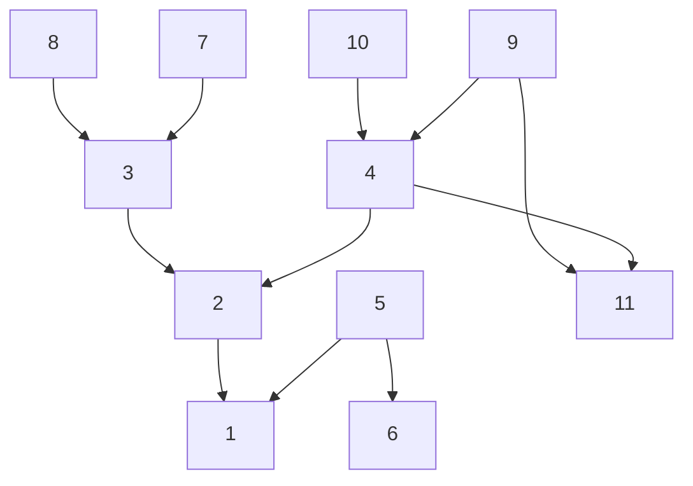
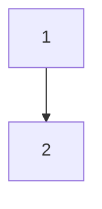
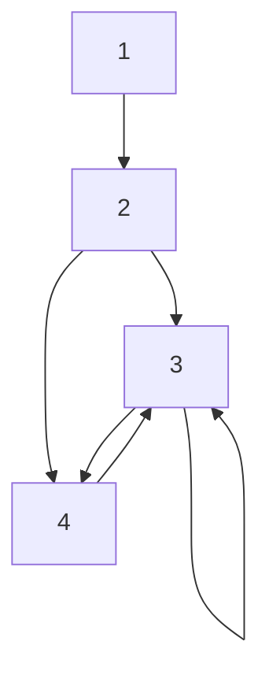
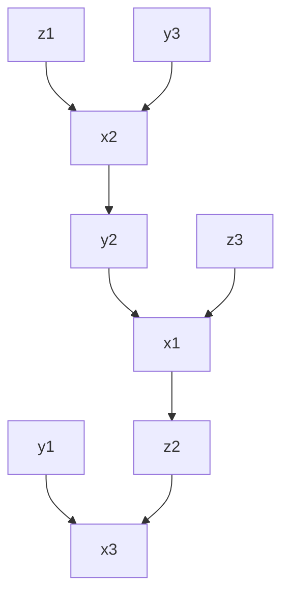

# Generating Sequential Code from BUGS Program

## Motivations

JuliaBUGS compiles a BUGS program into a directed probabilistic graphical model. 
The graphical model is also a dependence graph between the variables in the model/program.

With the dependence graph, execution of the probabilistic program can be carried out by visiting nodes (variables) in the graph following a topological order. 
(Parallel computing opportunities are also exposed by exploiting the dependence relationship.)

The issue is that, given the semantics of BUGS program, every element of an array can be random variable, thus demands its own node in the graph.
So naively convert the graph execution to sequential programs would amounts to fully unrolling all the loops, which is not feasible, particularly for AD tools.

A good solution is then to transform the possibly out-of-sequential-order user-provided programs into correct sequential programs (correctness is defined as no read before write), using the dependence graph.
Program transformation is a well-studied topic, and it has been recognized as a fundamentally challenging task  in terms of conceptual understanding, algorithms design, and practical implementation.

Traditionally, program transformation is formulated as transforming an program already in valid sequential order into a more performant version by considering the underlying hardware characteristics (memory, parallel architecture, etc.) 
For BUGS, in contrast, the task is to transform a potentially out of sequential order program into a sequentially correct program.

Traditional program transformation is often formulated as optimizing a performant metric under the constraint of respect all the existing dependence.
These optimizations can be [fill in here]. The local optimizations are usually a bag of tricks and heuristics. While some others can be formulated using mathematical framework.

For JuliaBUGS, it is worth making clear that the target is not optimizing the generated program, but correctness with respect to the sequential execution order.
In a way, this can be understood as find an ordering of the iteration vectors given the dependence (so a bit reverse of the traditional analysis).
The problem is hard, because the parameters to be find are the dependence distance.

We want to restrict ourselves and ask the question, how to use a minimal set of transformations to generate sequential programs from BUGS programs when they are out of order, if not, then directly use the program. Also provide clear feedback to user so they can rewrite the program.  

For a start, the set of possible transforms only contains the statement reordering transformation.

Statement reordering transformation is a program transformation that changes the execution order of statements within a program without altering the statements themselves.

## A Motivating Example

Look at `Rats`

```julia
begin
    for i in 1:N
        for j in 1:T
            Y[i, j] ~ dnorm(mu[i, j], tau_c)              # (1)
            mu[i, j] = alpha[i] + beta[i] * (x[j] - xbar)  # (2)
        end
        alpha[i] ~ dnorm(alpha_c, alpha_tau)               # (3)
        beta[i] ~ dnorm(beta_c, beta_tau)                  # (4)
    end
    tau_c ~ dgamma(0.001, 0.001)                          # (5)
    sigma = 1 / sqrt(tau_c)                                # (6)
    alpha_c ~ dnorm(0.0, 1.0e-6)                           # (7)
    alpha_tau ~ dgamma(0.001, 0.001)                       # (8)
    beta_c ~ dnorm(0.0, 1.0e-6)                            # (9)
    beta_tau ~ dgamma(0.001, 0.001)                        # (10)
    alpha0 = alpha_c - xbar * beta_c                        # (11)
end
```

A sequential version would be 

```julia
begin
    tau_c ~ dgamma(0.001, 0.001)                           # (5)
    sigma = 1 / sqrt(tau_c)                                # (6)
    alpha_c ~ dnorm(0.0, 1.0e-6)                           # (7)
    alpha_tau ~ dgamma(0.001, 0.001)                       # (8)
    beta_c ~ dnorm(0.0, 1.0e-6)                            # (9)
    beta_tau ~ dgamma(0.001, 0.001)                        # (10)
    
    for i in 1:N
        alpha[i] ~ dnorm(alpha_c, alpha_tau)               # (3)
        beta[i] ~ dnorm(beta_c, beta_tau)                  # (4)
        
        for j in 1:T
            mu[i, j] = alpha[i] + beta[i] * (x[j] - xbar)  # (2)
            Y[i, j] ~ dnorm(mu[i, j], tau_c)               # (1)
        end
    end
    
    alpha0 = alpha_c - xbar * beta_c                       # (11)
end
```

Another equally valid one is

```julia
begin
    tau_c ~ dgamma(0.001, 0.001)                           # (5)
    sigma = 1 / sqrt(tau_c)                                # (6)
    alpha_c ~ dnorm(0.0, 1.0e-6)                           # (7)
    alpha_tau ~ dgamma(0.001, 0.001)                       # (8)
    beta_c ~ dnorm(0.0, 1.0e-6)                            # (9)
    beta_tau ~ dgamma(0.001, 0.001)                        # (10)
    
    for i in 1:N
        alpha[i] ~ dnorm(alpha_c, alpha_tau)               # (3)
    end

    for i in 1:N
        beta[i] ~ dnorm(beta_c, beta_tau)                  # (4)
    end

    for i in 1:N
        for j in 1:T
            mu[i, j] = alpha[i] + beta[i] * (x[j] - xbar)  # (2)
        end
    end
    
    for i in 1:N
        for j in 1:T    
            Y[i, j] ~ dnorm(mu[i, j], tau_c)               # (1)
        end
    end
    
    alpha0 = alpha_c - xbar * beta_c                        # (11)
end
```

All these program has the same semantic for BUGS. (Given the same data, they all compile to the same model/graph).

The difference is, when interpreting `~` as sampling, the latter two can run sequentially without encountering use before write problem.
I.e., sequential versions of BUGS program respect the dependencies and topological order of the variables in the graphical model.

We will use a dependence graph of statements. (This is different from the dependence graph produced by JuliaBUGS, although the former can be obtained by merging vertices).

Here is a concrete example for when an edge exists: (excerpt of the `Rats` program )

```julia
for i in 1:N
    for j in 1:T
        Y[i, j] ~ dnorm(mu[i, j], tau_c)              # (1)
        mu[i, j] = alpha[i] + beta[i] * (x[j] - xbar)  # (2)
    end
end
```

statement 2 defines `mu[1, 1], m[1, 2], ...` and these variables are used by statement 1 when doing computation for `Y[1, 1], Y[1, 2], ...`

So the dependency graph contains edge (2) -> (1).

To relate to the classic dependence analysis language, this is an example of true dependence (also named flow dependence, Read-After-Write dependence).

For `rats`, we obtain this graph



There is no cycle in the dependency graph.

Question is: is the dependence graph enough to rewrite the original `Rats` program into the first seqeuntial version of it?

Consider example

```julia
for i in 1:N
    x[i] ~ normal(0, 1)     (1)
    y[i] ~ normal(x[N], i)  (2) 
end
```

the dependency graph in this case is very simple



Question is, can we run the above code?

The answer is no, because each `y[i]` require `x[N]` to compute.
And `x[N]` is computed at the end of the loop iteration.

In this case, we have to fission the loop, and the valid sequential program is

```julia
for i in 1:N
    x[i] ~ normal(0, 1)     (1)
end
for i in 1:N    
    y[i] ~ normal(x[N], i)  (2) 
end
```

So we can rewrite the `Rats` program to the second sequential version.

To be able to write to the second version, we would need another set of concepts: iteration space and dependence vector.


BUGS syntax coincides with the first condition, and we'll restrict the analysis to the second case.

Iteration Vector and Iteration Space:

We will shy away from giving formal definitions. But instead, use 

```julia
for i in 1:2
    for j in 1:3
        x[i] ~ normal(0, j)     (1)
        y[i] ~ normal(x[2], i)  (2) 
    end
end
```

as an example.

statement 1 and 2 will see the same iteration vectors. And these vectors are `(1, 1), (1, 2), ...`. By restricting the ordering on the loop bounds, we can use lexicographical order to use as the total order of the iteration vectors. 

The iteration space is the set of integer pairs defined by the cartesian product of the loop ranges, in this case `1:2 × 1:3`. Each point (i, j) in this 2D integer grid corresponds to one execution of statement S. But the iteration space can also be a triangle, and more general, polyhedral shaped grid.

We can think of each statement execution (at a specific iteration $\vec{i}$) as reading from some memory locations and writing to others. Dependence analysis tracks when different statement executions (at iterations $\vec{i}$ and $\vec{j}$) read or write the same memory location, potentially creating a dependence.

Suppose a statement S1 in iteration $\vec{i}$ has a dependence (flow, anti-, or output) with statement S2 in iteration $\vec{j}$. The dependence vector (or distance vector) $\vec{d}$ for this dependence instance is defined as:
$$ \vec{d} = \vec{j} - \vec{i} = (j_1 - i_1, j_2 - i_2, \dots, j_d - i_d) $$ (sink - source)

For instance, the dependence vector between `x[2]` and `y[1]` is `(-1, 0)` because `x[2]` is defined on the iteration with iteration vector (2, 1), and `y[1]` is defined on iteration with iteration vector (1, 1).

When the first non-zero element of any dependence vector is negative, it means that there is a dependence violation. Let's prove this intuitively:

In sequential execution, iterations are executed in lexicographical order of their iteration vectors. For example, in a nested loop, we execute (1,1), (1,2), ..., (1,n), (2,1), (2,2), and so on.

Consider a dependence from iteration vector $\vec{i}$ to iteration vector $\vec{j}$, with dependence vector $\vec{d} = \vec{j} - \vec{i}$.

If the first non-zero element of $\vec{d}$ is negative, it means that $\vec{j}$ comes lexicographically before $\vec{i}$ in the iteration space. In other words, the sink iteration $\vec{j}$ would execute before the source iteration $\vec{i}$ in sequential order.

This creates a violation because:
1. The source iteration $\vec{i}$ produces a value that the sink iteration $\vec{j}$ needs
2. But $\vec{j}$ executes before $\vec{i}$ in sequential order
3. Therefore, $\vec{j}$ would use a value that hasn't been produced yet

For example, if we have a dependence vector $\vec{d} = (-1, 2)$, the sink iteration is one step backward in the outer loop compared to the source. This means the sink would execute before the source in sequential execution, creating an impossible situation where an iteration needs a value that will only be computed in the future.

Such dependencies cannot be satisfied in the original sequential execution order, indicating a fundamental dependence violation.

Come back to dependence graph and loops in it.
We can't topologically sort the nodes when there are loops in it.
Generally there are two kinds of loop, self loop and a cycle.

Before we can generate sequential programs, we want to eliminate the cycles where the underlying program can be sequentially executable. As the cycle here is conservative.

for instance

```julia
x[6] ~ Normal() # (1)

for i in 1:5
    x[i] = x[i+1] + i # (2)  
end
```

would create a self cycle from 2 -> 2, and this program can't be sequentially executed, because computing `x[1]` need `x[2]` and `x[2]` are assigned at a later iteration.

```julia
x[1] ~ Normal() # (1)

for i in 2:5
    x[i] = x[i-1] + i # (2)  
end
```

is valid. 

It is useful to introduce two more concepts into the picture to aid the following discussion: loop independent and loop carried dependence.
The reason is that self loop is related to loop carried dependence and cycles are related to loop independent dependence.

Loop-independent dependence is dependence with dependence vector with all zeros. 
loop dependence that is not Loop-carried dependence that is not loop-independent dependence is. 

If all the dependence vectors are valid (the first non-zero element is positive)
then we can allow the loops. 
But we won't merge loops. 

If two statement form a loop and they are in different loops, loop fusion is then needed. But as it requires matching loop bounds and induction variables, we'll not consider transform them.

### Case 2: requires loop fusion

```julia
x[1] ~ dnorm(0, 1)  // 1
  
sumX[1] = x[1]  // 2
for i in 2:N
    sumX[i] = sumX[i-1] + x[i]  // 3
end

for i in 2:N
    x[i] ~ dnorm(sumX[i-1], tau)  // 4
end
```

The issue here is that there is a dependency between `x[i]` and `x[i-1]` via `sumX[i-1]`.
So we need to compute `x[i]` and `sumX[i-1]` (or `sumX[i]`) in the same loop iteration.

This may seem to be a an easy issue.
But it can be made more complicated in case where indices are affine transformation of loop induction variables. 

For instance,

```julia
sumX[1] = x[1]
for i in 2:N
    sumX[i] = sumX[i-1] + x[i]
end

# loop over even indices
for i in 1:N/2
    x[2*i] ~ dnorm(sumX[2*i-1], tau)
end

# loop over odd indices
for i in 1:N/2
    x[2*i + 1] ~ dgamma(sumX[2*i], tau)
end
```

then we would need to somehow merge the later two loops and the loop over `sumX`.

The dependency graph for here is 



### Introduction of nested indexing complicates things

They don't change the nature of the problem (which is about dependency).
But they can make the worst case really really bad.

Just consider

```julia
begin
    z[2] = f(x[1])
    y[2] = g(x[3])

    for i in 1:3
        x[i] = y[a[i]] + z[b[i]]
    end
end

data = (a = [2, 3, 1], b = [3, 1, 2])
```

this results in the following dependencies

```julia
x[1] <- y[2], z[3]
x[2] <- y[3], z[1]
x[3] <- y[1], z[2]
z[2] <- x[1]
y[2] <- x[2]
```



This represents a worst case where we probably can't do much better than fully unrolling.

---

trying to get a grander and unified story behind  

question: when can we switch the order of statements and be fine


## Next step: generating Julia function that computes the log density

The sequential-ized fissioned version of the model is:

```julia
quote
    var"beta.tau" ~ dgamma(0.001, 0.001)
    var"beta.c" ~ dnorm(0.0, 1.0e-6)
    var"alpha.tau" ~ dgamma(0.001, 0.001)
    var"alpha.c" ~ dnorm(0.0, 1.0e-6)
    alpha0 = var"alpha.c" - xbar * var"beta.c"
    var"tau.c" ~ dgamma(0.001, 0.001)
    sigma = 1 / sqrt(var"tau.c")
    for i = 1:30
        beta[i] ~ dnorm(var"beta.c", var"beta.tau")
    end
    for i = 1:30
        alpha[i] ~ dnorm(var"alpha.c", var"alpha.tau")
    end
    for i = 1:30
        for j = 1:5
            mu[i, j] = alpha[i] + beta[i] * (x[j] - xbar)
        end
    end
    for i = 1:30
        for j = 1:5
            Y[i, j] \eqsim dnorm(mu[i, j], var"tau.c")
        end
    end
end
```

We introduce a new operator into the program `\eqsim` to indicate that the left hand side is an observation.

## Separate the source generation into two steps for clarity and reuse

### Lowering BUGS program to distinguish `observation`s and `model parameters`s

Because the code for observations and model parameters are different, it makes sense to introduce a new type of statements to distinguish between the two types.
To this end, I decided that `≂`(`\eqsim`) is a good choice.

So the new syntax becomes something like
```julia
@bugs begin
    a = b + 1 # deterministic
    a ~ Normal() # model parameters
    a ≂ Normal() # observations
end
```

### support of missing data

What are missing data?
Mixed observation and model parameters.
The solution is to introduce an if statement to qualify the two types of statements.

For instance,

```julia
@bugs begin
    for i in 1:2
        for j in 1:5
            x[i, j] ~ Normal()
        end
    end
end

data = (x = [1 2 missing 4 5; 1 2 missing 4 5])
```

generated code:

```julia
begin
    for i in 1:2
        for j in 1:5
            if i == 1 && j == 3 || i == 2 && j == 3
                x[i, j] ~ Normal()
            else
                x[i, j] ≂ Normal()
            end
        end
    end
end
```

---

The interface design:
* automatic?
  * fallback
* or make users specify which to use
  * let's use generated function by default
    * keep a flag? `set_eval_mode`


> It should be noted that stochastic statements and deterministic statements are not created equal because of the way the program is executed.
On a high level, the program defines a computation that takes values of model parameters, and returns the log density (log prior + log likelihood) of the model.
This means that even if the stochastic statements are not sorted, we can still produce correct results, by:
(1) first setting the values of the model parameters,
(2) executing the deterministic statements to decide the values of variables,
(3) go through all the stochastic statements, and compute the log density for each of them.
So if we all we care about is the log density, we only need to sort the deterministic statements.
However, if we want to able to do ancestral sampling (and simulation), we need to sort the stochastic statements.
Although not sorting the stochastic statements does not make the problem simpler fundamentally, in some cases, sorting the stochastic statements might be hard, while sorting the deterministic statements is trivial.
