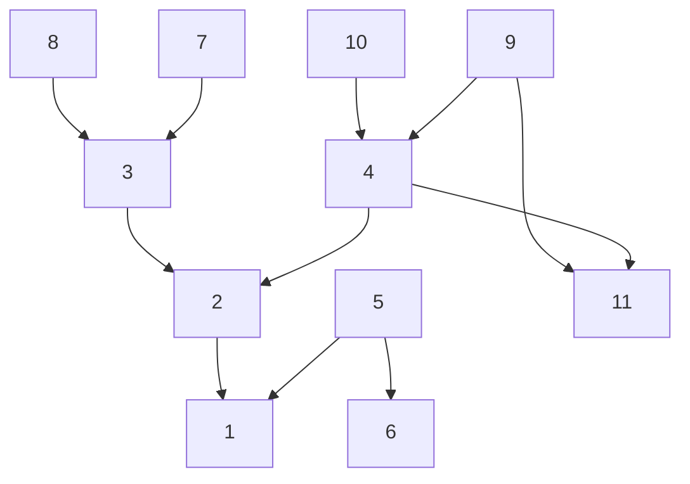
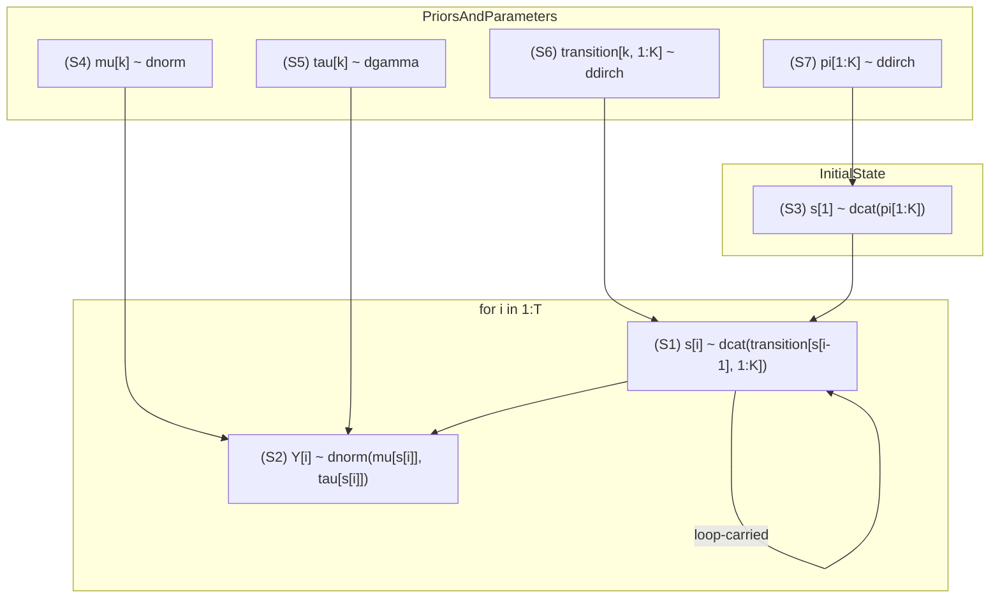
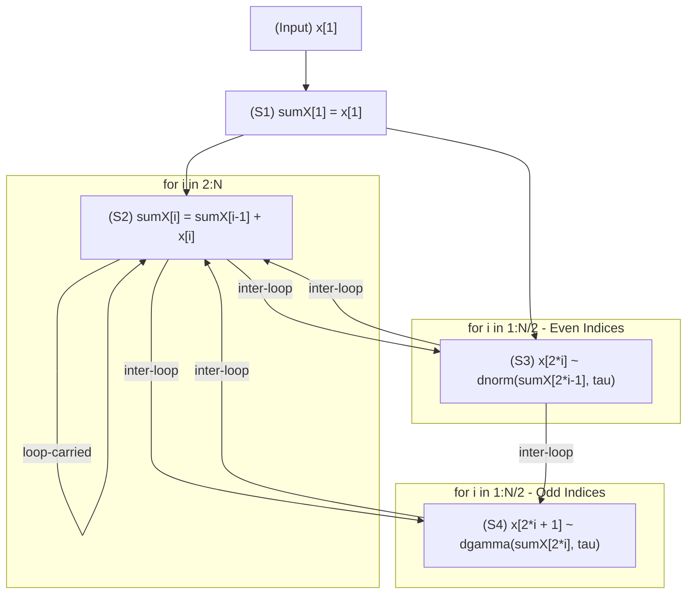
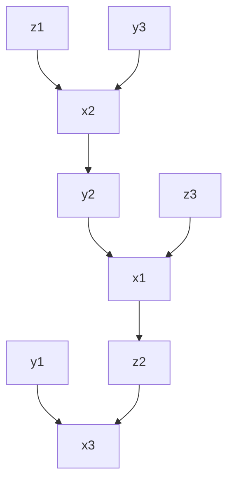
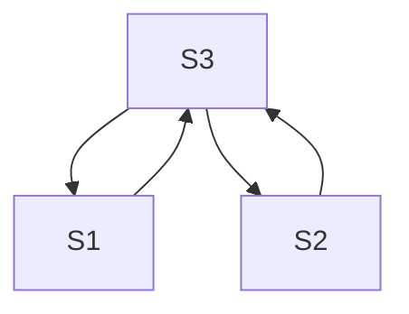

# Generating Sequential Code from BUGS Program

## Transform BUGS Programs into Sequential Programs

JuliaBUGS compiles a BUGS program into a directed probabilistic graphical model. This graphical model also serves as a dependence graph between the variables in the model/program.

With the dependence graph, the execution of the probabilistic program can be carried out by visiting nodes (variables) in the graph following a topological order. (Parallel computing opportunities are also exposed by exploiting the dependence relationships.)

The challenge arises because, given the semantics of the BUGS language, every element of an array can be a random variable, thus demanding its own node in the graph. Consequently, naively converting the graph execution into sequential programs would amount to fully unrolling all loops, which is often infeasible, particularly for automatic differentiation (AD) tools.

A potential solution is to transform the user-provided program, which might be out of sequential order, into a correct sequential program. Correctness here is defined as ensuring no variable is read before it is written. 

Program transformation is a well-studied topic. It is known to be very challenging in terms of conceptual understanding, algorithm design, and practical implementation.

Traditionally, program transformation optimizes sequentially valid programs for performance (speed, memory usage) based on hardware characteristics, while respecting data dependencies. 

For JuliaBUGS, it's crucial to clarify that the primary goal is not optimizing the generated program's performance but ensuring its correctness with respect to sequential execution order. The task is to transform a potentially out-of-sequential-order program into a sequentially correct one.

We aim to restrict ourselves initially and ask: How can we use a minimal set of transformations, starting with just statement reordering, to generate correct sequential programs from BUGS programs that might specify operations out of order? If the original program is already sequentially correct, it should be used directly. Furthermore, we need to provide clear feedback to the user if a transformation is necessary or if the program structure inherently prevents a valid sequential ordering, guiding them on how to rewrite it.

Consider the `Rats` example:

```julia
begin
    for i in 1:N
        for j in 1:T
            Y[i, j] ~ dnorm(mu[i, j], tau_c)              # (1)
            mu[i, j] = alpha[i] + beta[i] * (x[j] - xbar)  # (2)
        end
        alpha[i] ~ dnorm(alpha_c, alpha_tau)               # (3)
        beta[i] ~ dnorm(beta_c, beta_tau)                  # (4)
    end
    tau_c ~ dgamma(0.001, 0.001)                          # (5)
    sigma = 1 / sqrt(tau_c)                                # (6)
    alpha_c ~ dnorm(0.0, 1.0e-6)                           # (7)
    alpha_tau ~ dgamma(0.001, 0.001)                       # (8)
    beta_c ~ dnorm(0.0, 1.0e-6)                            # (9)
    beta_tau ~ dgamma(0.001, 0.001)                        # (10)
    alpha0 = alpha_c - xbar * beta_c                        # (11)
end
```

This program defines the same probabilistic model (has the same BUGS semantics) as the following two versions:

Version 1 (Reordered Statements):
```julia
begin
    tau_c ~ dgamma(0.001, 0.001)                           # (5)
    sigma = 1 / sqrt(tau_c)                                # (6)
    alpha_c ~ dnorm(0.0, 1.0e-6)                           # (7)
    alpha_tau ~ dgamma(0.001, 0.001)                       # (8)
    beta_c ~ dnorm(0.0, 1.0e-6)                            # (9)
    beta_tau ~ dgamma(0.001, 0.001)                        # (10)
    
    for i in 1:N
        alpha[i] ~ dnorm(alpha_c, alpha_tau)               # (3)
        beta[i] ~ dnorm(beta_c, beta_tau)                  # (4)
        
        for j in 1:T
            mu[i, j] = alpha[i] + beta[i] * (x[j] - xbar)  # (2)
            Y[i, j] ~ dnorm(mu[i, j], tau_c)               # (1)
        end
    end
    
    alpha0 = alpha_c - xbar * beta_c                       # (11)
end
```

Version 2 (Reordered Statements + Loop Fission):
```julia
begin
    tau_c ~ dgamma(0.001, 0.001)                           # (5)
    sigma = 1 / sqrt(tau_c)                                # (6)
    alpha_c ~ dnorm(0.0, 1.0e-6)                           # (7)
    alpha_tau ~ dgamma(0.001, 0.001)                       # (8)
    beta_c ~ dnorm(0.0, 1.0e-6)                            # (9)
    beta_tau ~ dgamma(0.001, 0.001)                        # (10)
    
    for i in 1:N
        alpha[i] ~ dnorm(alpha_c, alpha_tau)               # (3)
    end

    for i in 1:N
        beta[i] ~ dnorm(beta_c, beta_tau)                  # (4)
    end

    for i in 1:N
        for j in 1:T
            mu[i, j] = alpha[i] + beta[i] * (x[j] - xbar)  # (2)
        end
    end
    
    for i in 1:N
        for j in 1:T    
            Y[i, j] ~ dnorm(mu[i, j], tau_c)               # (1)
        end
    end
    
    alpha0 = alpha_c - xbar * beta_c                        # (11)
end
```

While all three programs define the same model, only the latter two can run sequentially (e.g., for sampling) without encountering a "read before write" error. These are called *sequential versions* because they respect data dependencies in order.

We use a *statement dependence graph* to analyze these dependencies. An edge exists from statement S_source to S_sink if S_sink uses a value defined by S_source.

Consider this excerpt from the original `Rats` program:
```julia
for i in 1:N
    for j in 1:T
        Y[i, j] ~ dnorm(mu[i, j], tau_c)              # (1)
        mu[i, j] = alpha[i] + beta[i] * (x[j] - xbar)  # (2)
    end
end
```
Statement (2) defines `mu[i, j]`, which statement (1) uses. Thus, the dependence graph contains an edge (2) -> (1). This is a *flow dependence* (or Read-After-Write). (We will not consider Write-After-Read and Write-After-Write dependencies.)

The full statement dependence graph for `Rats` is:


This graph is acyclic. But given this dependence graph, we can only produce Version 2 of the program by fissioning all the loops. The fissioning is conservative because given the dependence edges, we can only ensure the sequential order by finishing all the computation associated with a statement before moving on to the next one.

Consider this example:
```julia
for i in 1:N
    x[i] ~ normal(0, 1)     # (1)
    y[i] ~ normal(x[N], i)  # (2) 
end
```
The dependence graph is just (1) -> (2), which is acyclic. However, this loop cannot run sequentially. Statement (2) at iteration `i` needs `x[N]`, but statement (1) defines `x[N]` only at iteration `N`. Any iteration `i < N` for statement (2) reads `x[N]` before it's written.

The valid sequential version requires *loop fission*:
```julia
for i in 1:N
    x[i] ~ normal(0, 1)     # (1)
end
for i in 1:N    
    y[i] ~ normal(x[N], i)  # (2) 
end
```

But this not totally satisfactory, because ideally we would want to be able to tell if we don't have to fission all the loops like Version 1 of `Rats`.

This shows the statement dependence graph alone is not quite sufficient. We need to analyze dependencies within loops more precisely using iteration spaces and dependence vectors. This allows transformations like loop fission (used in Version 2 of `Rats`).

**Iteration Space and Vectors**

Consider this loop:
```julia
for i in 1:2
    for j in 1:3
        x[i] ~ normal(0, j)     # (1)
        y[i] ~ normal(x[2], i)  # (2) 
    end
end
```

Each execution of the loop body corresponds to an *iteration vector* $\vec{k} = (i, j)$. The set of all possible iteration vectors is the *iteration space*, here $\{(i, j) | 1 \le i \le 2, 1 \le j \le 3\}$. Iterations execute sequentially in lexicographical order: (1,1), (1,2), (1,3), (2,1), (2,2), (2,3).

**Dependence Vectors**

If a statement execution at iteration $\vec{i}$ (source) defines a value used by a statement execution at iteration $\vec{j}$ (sink), the *dependence vector* is $\vec{d} = \vec{j} - \vec{i}$. It represents the distance between dependent iterations. (Sometimes, we don't care about the distance between define and use, so we can simply use the sign of the elements of the dependence vector to represent the dependence relation.)

For sequential execution to be valid, all dependence vectors $\vec{d}$ must be *lexicographically non-negative* ($\vec{d} \succeq \vec{0}$). This means either $\vec{d} = \vec{0}$ or the first non-zero element of $\vec{d}$ is positive.

A lexicographically negative vector ($\vec{d} \prec \vec{0}$) indicates a violation. It means the sink iteration $\vec{j}$ executes *before* the source iteration $\vec{i}$ in sequential order, but $\vec{j}$ needs the value produced by $\vec{i}$.

**Dependence Vectors and Sequential Execution**

Dependence vectors help analyze loops. Consider this invalid loop:
```julia
x[6] ~ Normal() # (1)

for i in 1:5
    x[i] = x[i+1] + i # (2)  
end
```
Statement (2) computes `x[i]` using `x[i+1]`. The value `x[i+1]` is defined by statement (2) at iteration `i+1` (source). It is used by statement (2) at iteration `i` (sink). The dependence vector is $\vec{d} = \vec{j}_{sink} - \vec{i}_{source} = (i) - (i+1) = (-1)$. Since $\vec{d} \prec \vec{0}$, this loop violates sequential order. Computing `x[1]` requires `x[2]`, defined in a later iteration.

This loop is sequentially valid:
```julia
x[1] ~ Normal() # (1)

for i in 2:5
    x[i] = x[i-1] + i # (2)  
end
```

Statement (2) computes `x[i]` using `x[i-1]`. The value `x[i-1]` is defined by statement (2) at iteration `i-1` (source). It is used by statement (2) at iteration `i` (sink). The dependence vector is $\vec{d} = \vec{j}_{sink} - \vec{i}_{source} = (i) - (i-1) = (1)$. Since $\vec{d} \succ \vec{0}$, this loop respects sequential order.

**Loop-Independent vs. Loop-Carried Dependencies**

Dependencies involving loops are classified by their dependence vector $\vec{d} = \vec{j} - \vec{i}$:
- **Loop-Independent Dependence:** Occurs within the same iteration: $\vec{d} = \vec{0}$.
- **Loop-Carried Dependence:** Occurs between different iterations: $\vec{d} \neq \vec{0}$.

The `Rats` example before is an example of (hierarchical) regression models. Many of these models don't model time, and there is no loop in the dependence graph.

But another very important class of models is state-space models where there are recursive structures and thus have loops in the dependence graph.

Consider this Hidden Markov Model (HMM) fragment:
```julia
# Main loop processing time steps 2 to T
for i in 2:T
    # State transition: s[i] depends on s[i-1]
    s[i] ~ dcat(transition[s[i-1], 1:K])  # (S1)
    
    # Emission model: Y[i] depends on s[i]
    Y[i] ~ dnorm(mu[s[i]], tau[s[i]])     # (S2)
end

# Initial state at time 1
s[1] ~ dcat(pi[1:K])                      # (S3) Prior for first state

for k in 1:K
    # Priors for parameters
    mu[k] ~ dnorm(0, 0.01)                # (S4) Mean for state k
    tau[k] ~ dgamma(0.01, 0.01)           # (S5) Precision for state k
    transition[k, 1:K] ~ ddirch(alpha[1:K]) # (S6) Transition probabilities from state k
    pi[1:K] ~ ddirch(alpha[1:K])          # (S7) Prior for initial state distribution
end
```



In this example, there is a self loop on `S1`. These represent the state transition.
To see that we can actually sequentially execute the program, we can compute the dependence vectors.

The computation of the dependence vectors is done in the following steps:
When executing the for loop from `i = 2` to `i = T`, we need to compute the dependence vector. Let's examine the case when `i = 2`:

- LHS: `s[2]` is defined at iteration `i=2`
- RHS: `s[1]` is defined at iteration `i=1`
- Dependence vector: $\vec{d} = \vec{j}_{sink} - \vec{i}_{source} = (2) - (1) = (1)$

All subsequent iterations follow the same pattern and have the same dependence vector of $(1)$. Because all dependence vectors are lexicographically non-negative, the loop is sequentially valid.

This requires storing the loop variable `i` for each variable, but we already computed this with JuliaBUGS compilation, so not much overhead is required. 

It should be noted that this approach doesn't scale well for general Julia programs, but it works appropriately for BUGS since the compilation process already has a time complexity of $O(N)$ with respect to the number of variables.

It is worth pause here and give a summary:
    
To transform a BUGS program into a sequentially valid program, we will only apply two simple transformations, loop fission and statement reordering. These transformations will not need to modify loop bounds, renaming variables, adding any control flow, or make any changes to specific statements.

A program that can be transformed are determined by the following procedure:

First a statement dependence graph is computed.

If the statement dependence graph is acyclic, then we topologically sort the statements and fission all the loops to create a sequentially valid program.

In case the statement dependence graph is not acyclic.
If the statements that form a cycle are all from the same loop (potentially at different nested levels), then we compute the dependence vectors to determine if the loop is sequentially valid. 

Otherwise, the program need to be rewritten.

We don't attempt to apply further transformations to the program, because it is a hard problem. We will use the following example to show why program transformations can be a difficult task. We will not attempt to implement the transformation demonstrated here.

Consider this model,

```julia
sumX[1] = x[1] # (S1)

# Loop 1: for i in 2:N
sumX[i] = sumX[i-1] + x[i] # (S2)
# End Loop 1

# Loop 2: for i in 1:N/2 (loop over even indices)
x[2*i] ~ dnorm(sumX[2*i-1], tau) # (S3)
# End Loop 2

# Loop 3: for i in 1:N/2 (loop over odd indices)
x[2*i + 1] ~ dgamma(sumX[2*i], tau) # (S4)
# End Loop 3
```

the dependency graph is:



This code exhibits a complex web of dependencies:
S2 (calculating sumX) depends on x values.
S3 (defining even xs) depends on odd sumX values.
S4 (defining odd xs) depends on even sumX values.
Critically, S2 needs both even and odd x values (calculated in S3 and S4 respectively) to calculate the sumX values that S3 and S4 themselves depend on. 

This creates a cyclical dependency across the three loops.
To resolve this and make the code sequentially executable, a sophisticated transformation involving loop fusion and statement interleaving is required. All three loops need to be merged into a single loop structure that correctly orders the calculations within each logical iteration i (from 1 to N).

A possible (conceptual) fused structure might look like this:

```julia
sumX[1] = x[1] 
# Potentially handle x[2] separately depending on loop bounds/logic
for i = 2 to N # Or a similar loop structure covering all indices
   if i is even:
       # Calculate x[i] (originally S3) - needs sumX[i-1]
       x[i] ~ dnorm(sumX[i-1], tau)
   else: # i is odd
       # Calculate x[i] (originally S4) - needs sumX[i-1]
       x[i] ~ dgamma(sumX[i-1], tau) 
   
   # Calculate sumX[i] (originally S2) - needs x[i] just calculated
   sumX[i] = sumX[i-1] + x[i]
end
```

Things can get even trickier when data are involved in computing the indices. For instance,

```julia
begin
    z[2] = f(x[1]) # (S1)
    y[2] = g(x[3]) # (S2)

    for i in 1:3
        x[i] = y[a[i]] + z[b[i]] # (S3)
    end
end

data = (a = [2, 3, 1], b = [3, 1, 2])
```

this results in the following dependencies between model variables

```julia
x[1] <- y[2], z[3]
x[2] <- y[3], z[1]
x[3] <- y[1], z[2]
z[2] <- x[1]
y[2] <- x[2]
```

with dependence graph



The statement dependence graph of this program, on the other hand is (obtained by merging all the `x` nodes)



This represents a worst case where we can't do much better than fully unrolling.

## Lowering BUGS programs into Julia programs that compute the log density

The Version 2 of `Rats` program is:

```julia
quote
    var"beta.tau" ~ dgamma(0.001, 0.001)
    var"beta.c" ~ dnorm(0.0, 1.0e-6)
    var"alpha.tau" ~ dgamma(0.001, 0.001)
    var"alpha.c" ~ dnorm(0.0, 1.0e-6)
    alpha0 = var"alpha.c" - xbar * var"beta.c"
    var"tau.c" ~ dgamma(0.001, 0.001)
    sigma = 1 / sqrt(var"tau.c")
    for i = 1:30
        beta[i] ~ dnorm(var"beta.c", var"beta.tau")
    end
    for i = 1:30
        alpha[i] ~ dnorm(var"alpha.c", var"alpha.tau")
    end
    for i = 1:30
        for j = 1:5
            mu[i, j] = alpha[i] + beta[i] * (x[j] - xbar)
        end
    end
    for i = 1:30
        for j = 1:5
            Y[i, j] \eqsim dnorm(mu[i, j], var"tau.c")
        end
    end
end
```

We made a simple change to the program to prepare for lowering: we need to distinguish between observations and model parameters (because they correspond to different code). We introduce a new operator into the program `\eqsim` to indicate that the left hand side is an observation.

BUGS supports mixing observations and model parameters for different elements of the same array variable.
To support this, we introduce a guard to use conditional logic to decide what computation to do for different iteration of the same statement.

```julia
@bugs begin
    for i in 1:2
        for j in 1:5
            x[i, j] ~ Normal()
        end
    end
end

data = (x = [1 2 missing 4 5; 1 2 missing 4 5])
```

generated code:

```julia
begin
    for i in 1:2
        for j in 1:5
            if i == 1 && j == 3 || i == 2 && j == 3
                x[i, j] ~ Normal()
            else
                x[i, j] ≂ Normal()
            end
        end
    end
end
```
