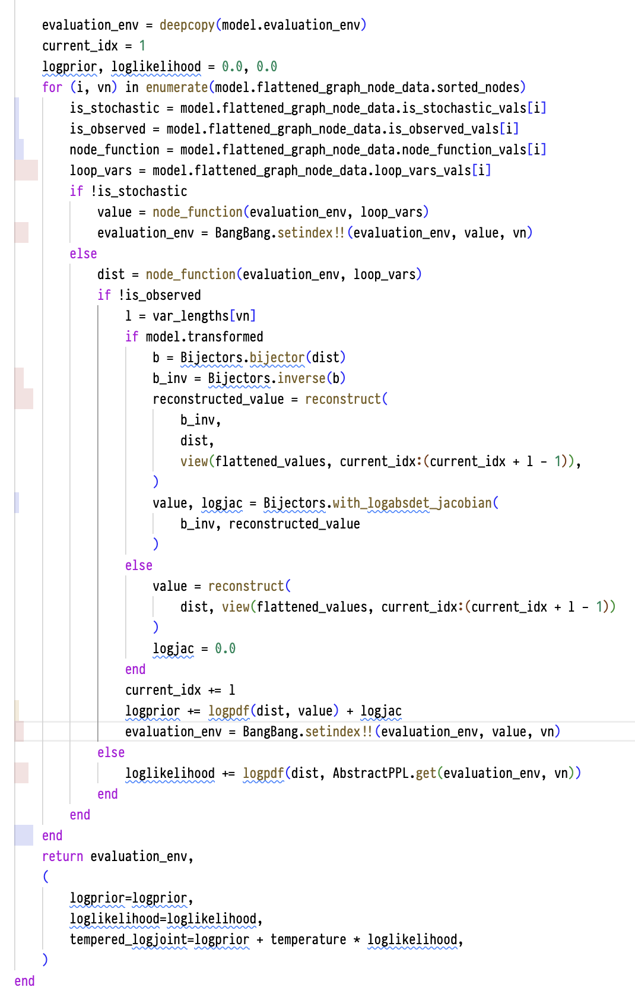

# Notes on the Performance Improvement
Jan 16 - 17, 2025

## Some manually written baselines

<details>
<summary> Baseline 1: </summary>

This is to get a feeling of the ideal performance of the log density evaluation.

```julia
using BangBang, Bijectors
using JuliaBUGS.BUGSPrimitives: dgamma, dnorm

function rats_logdensity_with_for_loops(evaluation_env, params)
    (; alpha, xbar, sigma, alpha0, x, mu, Y, beta) = evaluation_env

    gamma_bijector = Bijectors.bijector(dgamma(0.001, 0.001))
    gamma_bijector_inv = Bijectors.inverse(gamma_bijector)

    log_density = 0.0

    beta_tau, logjac_beta_tau = Bijectors.with_logabsdet_jacobian(
        gamma_bijector_inv, params[1]
    )
    log_density += logpdf(dgamma(0.001, 0.001), beta_tau) + logjac_beta_tau

    beta_c, logjac_beta_c = Bijectors.with_logabsdet_jacobian(identity, params[2])
    log_density += logpdf(dnorm(0.0, 1.0e-6), beta_c) + logjac_beta_c

    alpha_tau, logjac_alpha_tau = Bijectors.with_logabsdet_jacobian(
        gamma_bijector_inv, params[3]
    )
    log_density += logpdf(dgamma(0.001, 0.001), alpha_tau) + logjac_alpha_tau

    alpha_c, logjac_alpha_c = Bijectors.with_logabsdet_jacobian(identity, params[4])
    log_density += logpdf(dnorm(0.0, 1.0e-6), alpha_c) + logjac_alpha_c

    alpha0 = alpha_c - xbar * beta_c

    tau_c, logjac_tau_c = Bijectors.with_logabsdet_jacobian(gamma_bijector_inv, params[5])
    log_density += logpdf(dgamma(0.001, 0.001), tau_c) + logjac_tau_c

    sigma = 1 / sqrt(tau_c)

    counter = 6
    for i in 30:-1:1
        beta = BangBang.setindex!!(beta, params[counter], i)
        alpha = BangBang.setindex!!(alpha, params[counter + 1], i)
        counter += 2
    end

    # technically, for normal distributions, we don't need the logjac, but include
    # for consistency
    for i in 1:30
        alpha_i, logjac_alpha_i = Bijectors.with_logabsdet_jacobian(identity, alpha[i])
        log_density += logpdf(dnorm(alpha_c, alpha_tau), alpha_i) + logjac_alpha_i

        beta_i, logjac_beta_i = Bijectors.with_logabsdet_jacobian(identity, beta[i])
        log_density += logpdf(dnorm(beta_c, beta_tau), beta_i) + logjac_beta_i
    end

    for i in 1:30
        for j in 1:5
            mu = BangBang.setindex!!(mu, alpha[i] + beta[i] * (x[j] - xbar), i, j)
        end
    end

    for i in 1:30
        for j in 1:5
            log_density += logpdf(dnorm(mu[i, j], tau_c), Y[i, j])
        end
    end

    return log_density
end

evaluation_env = model.evaluation_env
rats_logdensity_with_for_loops(evaluation_env, param_values)
@benchmark rats_logdensity_with_for_loops($evaluation_env, $param_values)
```

```
BenchmarkTools.Trial: 10000 samples with 128 evaluations per sample.
 Range (min … max):  734.695 ns …  1.437 μs  ┊ GC (min … max): 0.00% … 0.00%
 Time  (median):     821.289 ns              ┊ GC (median):    0.00%
 Time  (mean ± σ):   825.103 ns ± 47.710 ns  ┊ GC (mean ± σ):  0.00% ± 0.00%

  ▄   ▂▁    ▃▁▁▁▁▂▁▁▁▁▂█▂▁▂▁▂▄▃▂▁▁  ▁▁▁ ▁  ▁                   ▁
  █▇▇▇██████████████████████████████████████████▇██▇▇▆▇▇▆▅▅▅▆▆ █
  735 ns        Histogram: log(frequency) by time       975 ns <

 Memory estimate: 0 bytes, allocs estimate: 0.
```

</details>

<details>
<summary> Baseline 2 (using `VarName`) </summary>

To verify that using `VarName` does not induce type instability.

```julia
using BangBang, Bijectors
using JuliaBUGS.BUGSPrimitives: dgamma, dnorm

function rats_logdensity_with_for_loops_using_varnames(evaluation_env, params)
    gamma_bijector = Bijectors.bijector(dgamma(0.001, 0.001))
    gamma_bijector_inv = Bijectors.inverse(gamma_bijector)

    log_density = 0.0

    beta_tau, logjac_beta_tau = Bijectors.with_logabsdet_jacobian(
        gamma_bijector_inv, params[1]
    )
    log_density += logpdf(dgamma(0.001, 0.001), beta_tau) + logjac_beta_tau

    beta_c, logjac_beta_c = Bijectors.with_logabsdet_jacobian(identity, params[2])
    log_density += logpdf(dnorm(0.0, 1.0e-6), beta_c) + logjac_beta_c

    alpha_tau, logjac_alpha_tau = Bijectors.with_logabsdet_jacobian(
        gamma_bijector_inv, params[3]
    )
    log_density += logpdf(dgamma(0.001, 0.001), alpha_tau) + logjac_alpha_tau

    alpha_c, logjac_alpha_c = Bijectors.with_logabsdet_jacobian(identity, params[4])
    log_density += logpdf(dnorm(0.0, 1.0e-6), alpha_c) + logjac_alpha_c

    xbar = AbstractPPL.get(evaluation_env, VarName{:xbar}())
    alpha0 = alpha_c - xbar * beta_c

    tau_c, logjac_tau_c = Bijectors.with_logabsdet_jacobian(gamma_bijector_inv, params[5])
    evaluation_env = BangBang.setindex!!(evaluation_env, tau_c, VarName{Symbol("tau.c")}())
    log_density += logpdf(dgamma(0.001, 0.001), tau_c) + logjac_tau_c

    sigma = 1 / sqrt(tau_c)

    counter = 6
    for i in 30:-1:1
        beta_i_vn = VarName{:beta}(IndexLens((i,)))
        alpha_i_vn = VarName{:alpha}(IndexLens((i,)))
        beta_i = params[counter]
        alpha_i = params[counter + 1]

        alpha_i, logjac_alpha_i = Bijectors.with_logabsdet_jacobian(identity, alpha_i)
        beta_i, logjac_beta_i = Bijectors.with_logabsdet_jacobian(identity, beta_i)

        log_density += logpdf(dnorm(alpha_c, alpha_tau), alpha_i) + logjac_alpha_i
        log_density += logpdf(dnorm(beta_c, beta_tau), beta_i) + logjac_beta_i

        evaluation_env = BangBang.setindex!!(evaluation_env, beta_i, beta_i_vn)
        evaluation_env = BangBang.setindex!!(evaluation_env, alpha_i, alpha_i_vn)
        counter += 2
    end

    for i in 1:30
        for j in 1:5
            alpha_i = AbstractPPL.get(evaluation_env, VarName{:alpha}(IndexLens((i,))))
            beta_i = AbstractPPL.get(evaluation_env, VarName{:beta}(IndexLens((i,))))
            x_j = AbstractPPL.get(evaluation_env, VarName{:x}(IndexLens((j,))))
            x_bar = AbstractPPL.get(evaluation_env, VarName{:xbar}())
            mu_i_j = alpha_i + beta_i * (x_j - x_bar)
            mu_i_j_vn = VarName{:mu}(IndexLens((i, j)))
            evaluation_env = BangBang.setindex!!(evaluation_env, mu_i_j, mu_i_j_vn)
        end
    end

    for i in 1:30
        for j in 1:5
            mu_i_j = AbstractPPL.get(evaluation_env, VarName{:mu}(IndexLens((i, j))))
            Y_i_j = AbstractPPL.get(evaluation_env, VarName{:Y}(IndexLens((i, j))))
            tau_c = AbstractPPL.get(evaluation_env, VarName{Symbol("tau.c")}())
            log_density += logpdf(dnorm(mu_i_j, tau_c), Y_i_j)
        end
    end

    return log_density
end

evaluation_env = model.evaluation_env
rats_logdensity_with_for_loops_using_varnames(evaluation_env, param_values)
@benchmark rats_logdensity_with_for_loops_using_varnames($evaluation_env, $param_values)
```

```
BenchmarkTools.Trial: 10000 samples with 126 evaluations per sample.
 Range (min … max):  738.095 ns …  1.448 μs  ┊ GC (min … max): 0.00% … 0.00%
 Time  (median):     829.698 ns              ┊ GC (median):    0.00%
 Time  (mean ± σ):   826.896 ns ± 26.225 ns  ┊ GC (mean ± σ):  0.00% ± 0.00%

   ▁▂                            ▄▅█▃ ▁▁                       ▁
  ▆██▆▆▅▆▆▆▇▇▆▇▆▆▇██▇█▇▇▇██▇▇▇▇▇█████▇█████▇██▇▇▇▇▆▆▆▆▅▅▆▆▆▆█▅ █
  738 ns        Histogram: log(frequency) by time       903 ns <

 Memory estimate: 0 bytes, allocs estimate: 0.
```

This is only slightly slower, but `VarName` does not cause issue, at least in this case.

</details>

## JuliaBUGS current performance (with master branch)

```julia
using JuliaBUGS
using BenchmarkTools
using LogDensityProblems

(; model_def, data, inits) = JuliaBUGS.BUGSExamples.rats
model = compile(model_def, data, inits)
param_values = rand(65)

@benchmark LogDensityProblems.logdensity($model, $param_values)
```

```
BenchmarkTools.Trial: 10000 samples with 1 evaluation per sample.
 Range (min … max):  39.375 μs …  10.686 ms  ┊ GC (min … max): 0.00% … 99.16%
 Time  (median):     46.792 μs               ┊ GC (median):    0.00%
 Time  (mean ± σ):   49.191 μs ± 150.253 μs  ┊ GC (mean ± σ):  4.30% ±  1.40%

         ▁▅▇▇▄▂▁▁▁▂▂▅▇█▆▆▅▄▄▂▂                                  
  ▁▁▂▂▃▄▆██████████████████████▇▅▄▄▃▃▃▂▂▂▂▂▂▂▂▂▂▂▂▁▁▁▁▁▁▁▁▁▁▁▁ ▄
  39.4 μs         Histogram: frequency by time         62.1 μs <

 Memory estimate: 60.44 KiB, allocs estimate: 1560.
```

### Profiling and understanding the performance issue

```julia
# @profview here comes with VSCode Julia extension
@profview for _ in 1:1000 # one iteration is too short to see the performance issue
    LogDensityProblems.logdensity(model, param_values)
end
```



Clearly there are some type instability issue (the red bars).

<details>
<summary> code_warntype output </summary>

```julia

MethodInstance for JuliaBUGS._tempered_evaluate!!(::JuliaBUGS.BUGSModel{Nothing, @NamedTuple{alpha::Vector{Float64}, beta.c::Int64, xbar::Int64, sigma::Float64, alpha0::Int64, x::Vector{Float64}, N::Int64, alpha.c::Int64, mu::Matrix{Float64}, alpha.tau::Int64, Y::Matrix{Int64}, T::Int64, beta::Vector{Float64}, beta.tau::Int64, tau.c::Int64}, Vector{Function}, Vector{Function}, @NamedTuple{x::Vector{Float64}, xbar::Int64, N::Int64, T::Int64, Y::Matrix{Int64}}}, ::Vector{Float64})
  from _tempered_evaluate!!(model::JuliaBUGS.BUGSModel, flattened_values::AbstractVector) @ JuliaBUGS ~/TuringLang/JuliaBUGS.jl/src/model.jl:576
Arguments
  #self#::Core.Const(JuliaBUGS._tempered_evaluate!!)
  model::JuliaBUGS.BUGSModel{Nothing, @NamedTuple{alpha::Vector{Float64}, beta.c::Int64, xbar::Int64, sigma::Float64, alpha0::Int64, x::Vector{Float64}, N::Int64, alpha.c::Int64, mu::Matrix{Float64}, alpha.tau::Int64, Y::Matrix{Int64}, T::Int64, beta::Vector{Float64}, beta.tau::Int64, tau.c::Int64}, Vector{Function}, Vector{Function}, @NamedTuple{x::Vector{Float64}, xbar::Int64, N::Int64, T::Int64, Y::Matrix{Int64}}}
  flattened_values::Vector{Float64}
Locals
  @_4::UNION{NOTHING, TUPLE{TUPLE{INT64, ABSTRACTPPL.VARNAME}, TUPLE{INT64, INT64}}}
  loglikelihood::ANY
  logprior::ANY
  current_idx::Int64
  evaluation_env::ANY
  var_lengths::DICT{<:ABSTRACTPPL.VARNAME, INT64}
  temperature::Float64
  @_11::ANY
  @_12::Int64
  vn::ABSTRACTPPL.VARNAME
  i::Int64
  logjac::ANY
  value::ANY
  reconstructed_value::ANY
  b_inv::ANY
  b::ANY
  l::Int64
  dist::ANY
  loop_vars::ANY
  node_function::FUNCTION
  is_observed::Bool
  is_stochastic::Bool
  @_26::DICT{<:ABSTRACTPPL.VARNAME, INT64}
Body::TUPLE{ANY, NAMEDTUPLE{(:LOGPRIOR, :LOGLIKELIHOOD, :TEMPERED_LOGJOINT), <:TUPLE{ANY, ANY, ANY}}}
1 ──        Core.NewvarNode(:(@_4))
│           Core.NewvarNode(:(loglikelihood))
│           Core.NewvarNode(:(logprior))
│           Core.NewvarNode(:(current_idx))
│           Core.NewvarNode(:(evaluation_env))
│           Core.NewvarNode(:(var_lengths))
│           (temperature = 1.0)
│    %8   = Base.getproperty(model, :transformed)::Bool
└───        goto #3 if not %8
2 ──        (@_26 = Base.getproperty(model, :transformed_var_lengths))
└───        goto #4
3 ──        (@_26 = Base.getproperty(model, :untransformed_var_lengths))
4 ┄─ %13  = @_26::DICT{<:ABSTRACTPPL.VARNAME, INT64}
│           (var_lengths = %13)
│    %15  = JuliaBUGS.deepcopy::Core.Const(deepcopy)
│    %16  = Base.getproperty(model, :evaluation_env)::@NamedTuple{alpha::Vector{Float64}, beta.c::Int64, xbar::Int64, sigma::Float64, alpha0::Int64, x::Vector{Float64}, N::Int64, alpha.c::Int64, mu::Matrix{Float64}, alpha.tau::Int64, Y::Matrix{Int64}, T::Int64, beta::Vector{Float64}, beta.tau::Int64, tau.c::Int64}
│           (evaluation_env = (%15)(%16))
│           (current_idx = 1)
│           (logprior = 0.0)
│           (loglikelihood = 0.0)
│    %21  = JuliaBUGS.enumerate::Core.Const(enumerate)
│    %22  = Base.getproperty(model, :flattened_graph_node_data)::JULIABUGS.FLATTENEDGRAPHNODEDATA{VECTOR{FUNCTION}, VECTOR{FUNCTION}}
│    %23  = Base.getproperty(%22, :sorted_nodes)::VECTOR{<:ABSTRACTPPL.VARNAME}
│    %24  = (%21)(%23)::BASE.ITERATORS.ENUMERATE{I} WHERE I<:(VECTOR{<:ABSTRACTPPL.VARNAME})
│           (@_4 = Base.iterate(%24))
│    %26  = @_4::UNION{NOTHING, TUPLE{TUPLE{INT64, ABSTRACTPPL.VARNAME}, TUPLE{INT64, INT64}}}
│    %27  = (%26 === nothing)::Bool
│    %28  = Base.not_int(%27)::Bool
└───        goto #15 if not %28
5 ┄─        Core.NewvarNode(:(@_11))
│           Core.NewvarNode(:(logjac))
│           Core.NewvarNode(:(value))
│           Core.NewvarNode(:(reconstructed_value))
│           Core.NewvarNode(:(b_inv))
│           Core.NewvarNode(:(b))
│           Core.NewvarNode(:(l))
│           Core.NewvarNode(:(dist))
│    %38  = @_4::TUPLE{TUPLE{INT64, ABSTRACTPPL.VARNAME}, TUPLE{INT64, INT64}}
│    %39  = Core.getfield(%38, 1)::TUPLE{INT64, ABSTRACTPPL.VARNAME}
│    %40  = Base.indexed_iterate(%39, 1)::Core.PartialStruct(Tuple{Int64, Int64}, Any[Int64, Core.Const(2)])
│           (i = Core.getfield(%40, 1))
│           (@_12 = Core.getfield(%40, 2))
│    %43  = @_12::Core.Const(2)
│    %44  = Base.indexed_iterate(%39, 2, %43)::Core.PartialStruct(Tuple{AbstractPPL.VarName, Int64}, Any[AbstractPPL.VarName, Core.Const(3)])
│           (vn = Core.getfield(%44, 1))
│    %46  = Core.getfield(%38, 2)::Tuple{Int64, Int64}
│    %47  = Base.getproperty(model, :flattened_graph_node_data)::JULIABUGS.FLATTENEDGRAPHNODEDATA{VECTOR{FUNCTION}, VECTOR{FUNCTION}}
│    %48  = Base.getproperty(%47, :is_stochastic_vals)::Vector{Bool}
│    %49  = i::Int64
│           (is_stochastic = Base.getindex(%48, %49))
│    %51  = Base.getproperty(model, :flattened_graph_node_data)::JULIABUGS.FLATTENEDGRAPHNODEDATA{VECTOR{FUNCTION}, VECTOR{FUNCTION}}
│    %52  = Base.getproperty(%51, :is_observed_vals)::Vector{Bool}
│    %53  = i::Int64
│           (is_observed = Base.getindex(%52, %53))
│    %55  = Base.getproperty(model, :flattened_graph_node_data)::JULIABUGS.FLATTENEDGRAPHNODEDATA{VECTOR{FUNCTION}, VECTOR{FUNCTION}}
│    %56  = Base.getproperty(%55, :node_function_vals)::Vector{Function}
│    %57  = i::Int64
│           (node_function = Base.getindex(%56, %57))
│    %59  = Base.getproperty(model, :flattened_graph_node_data)::JULIABUGS.FLATTENEDGRAPHNODEDATA{VECTOR{FUNCTION}, VECTOR{FUNCTION}}
│    %60  = Base.getproperty(%59, :loop_vars_vals)::ANY
│    %61  = i::Int64
│           (loop_vars = Base.getindex(%60, %61))
│    %63  = is_stochastic::Bool
│    %64  = !%63::Bool
└───        goto #7 if not %64
6 ── %66  = node_function::FUNCTION
│    %67  = evaluation_env::ANY
│    %68  = loop_vars::ANY
│           (value = (%66)(%67, %68))
│    %70  = BangBang.setindex!!::Core.Const(BangBang.setindex!!)
│    %71  = evaluation_env::ANY
│    %72  = value::ANY
│    %73  = vn::ABSTRACTPPL.VARNAME
│           (evaluation_env = (%70)(%71, %72, %73))
└───        goto #13
7 ── %76  = node_function::FUNCTION
│    %77  = evaluation_env::ANY
│    %78  = loop_vars::ANY
│           (dist = (%76)(%77, %78))
│    %80  = is_observed::Bool
│    %81  = !%80::Bool
└───        goto #12 if not %81
8 ── %83  = var_lengths::DICT{<:ABSTRACTPPL.VARNAME, INT64}
│    %84  = vn::ABSTRACTPPL.VARNAME
│           (l = Base.getindex(%83, %84))
│    %86  = Base.getproperty(model, :transformed)::Bool
└───        goto #10 if not %86
9 ── %88  = Bijectors.bijector::Core.Const(Bijectors.bijector)
│    %89  = dist::ANY
│           (b = (%88)(%89))
│    %91  = Bijectors.inverse::Core.Const(InverseFunctions.inverse)
│    %92  = b::ANY
│           (b_inv = (%91)(%92))
│    %94  = JuliaBUGS.reconstruct::Core.Const(JuliaBUGS.reconstruct)
│    %95  = b_inv::ANY
│    %96  = dist::ANY
│    %97  = JuliaBUGS.view::Core.Const(view)
│    %98  = JuliaBUGS.:(:)::Core.Const(Colon())
│    %99  = current_idx::Int64
│    %100 = JuliaBUGS.:-::Core.Const(-)
│    %101 = current_idx::Int64
│    %102 = l::Int64
│    %103 = (%101 + %102)::Int64
│    %104 = (%100)(%103, 1)::Int64
│    %105 = (%98)(%99, %104)::UnitRange{Int64}
│    %106 = (%97)(flattened_values, %105)::Core.PartialStruct(SubArray{Float64, 1, Vector{Float64}, Tuple{UnitRange{Int64}}, true}, Any[Vector{Float64}, Tuple{UnitRange{Int64}}, Int64, Core.Const(1)])
│           (reconstructed_value = (%94)(%95, %96, %106))
│    %108 = Bijectors.with_logabsdet_jacobian::Core.Const(ChangesOfVariables.with_logabsdet_jacobian)
│    %109 = b_inv::ANY
│    %110 = reconstructed_value::ANY
│    %111 = (%108)(%109, %110)::ANY
│    %112 = Base.indexed_iterate(%111, 1)::ANY
│           (value = Core.getfield(%112, 1))
│           (@_11 = Core.getfield(%112, 2))
│    %115 = @_11::ANY
│    %116 = Base.indexed_iterate(%111, 2, %115)::ANY
│           (logjac = Core.getfield(%116, 1))
└───        goto #11
10 ─ %119 = JuliaBUGS.reconstruct::Core.Const(JuliaBUGS.reconstruct)
│    %120 = dist::ANY
│    %121 = JuliaBUGS.view::Core.Const(view)
│    %122 = JuliaBUGS.:(:)::Core.Const(Colon())
│    %123 = current_idx::Int64
│    %124 = JuliaBUGS.:-::Core.Const(-)
│    %125 = current_idx::Int64
│    %126 = l::Int64
│    %127 = (%125 + %126)::Int64
│    %128 = (%124)(%127, 1)::Int64
│    %129 = (%122)(%123, %128)::UnitRange{Int64}
│    %130 = (%121)(flattened_values, %129)::Core.PartialStruct(SubArray{Float64, 1, Vector{Float64}, Tuple{UnitRange{Int64}}, true}, Any[Vector{Float64}, Tuple{UnitRange{Int64}}, Int64, Core.Const(1)])
│           (value = (%119)(%120, %130))
└───        (logjac = 0.0)
11 ┄ %133 = current_idx::Int64
│    %134 = l::Int64
│           (current_idx = %133 + %134)
│    %136 = JuliaBUGS.:+::Core.Const(+)
│    %137 = logprior::ANY
│    %138 = JuliaBUGS.:+::Core.Const(+)
│    %139 = dist::ANY
│    %140 = value::ANY
│    %141 = JuliaBUGS.logpdf(%139, %140)::ANY
│    %142 = logjac::ANY
│    %143 = (%138)(%141, %142)::ANY
│           (logprior = (%136)(%137, %143))
│    %145 = BangBang.setindex!!::Core.Const(BangBang.setindex!!)
│    %146 = evaluation_env::ANY
│    %147 = value::ANY
│    %148 = vn::ABSTRACTPPL.VARNAME
│           (evaluation_env = (%145)(%146, %147, %148))
└───        goto #13
12 ─ %151 = JuliaBUGS.:+::Core.Const(+)
│    %152 = loglikelihood::ANY
│    %153 = JuliaBUGS.logpdf::Core.Const(Distributions.logpdf)
│    %154 = dist::ANY
│    %155 = AbstractPPL.get::Core.Const(get)
│    %156 = evaluation_env::ANY
│    %157 = vn::ABSTRACTPPL.VARNAME
│    %158 = (%155)(%156, %157)::ANY
│    %159 = (%153)(%154, %158)::ANY
└───        (loglikelihood = (%151)(%152, %159))
13 ┄        (@_4 = Base.iterate(%24, %46))
│    %162 = @_4::UNION{NOTHING, TUPLE{TUPLE{INT64, ABSTRACTPPL.VARNAME}, TUPLE{INT64, INT64}}}
│    %163 = (%162 === nothing)::Bool
│    %164 = Base.not_int(%163)::Bool
└───        goto #15 if not %164
14 ─        goto #5
15 ┄ %167 = evaluation_env::ANY
│    %168 = (:logprior, :loglikelihood, :tempered_logjoint)::Core.Const((:logprior, :loglikelihood, :tempered_logjoint))
│    %169 = Core.apply_type(Core.NamedTuple, %168)::Core.Const(NamedTuple{(:logprior, :loglikelihood, :tempered_logjoint)})
│    %170 = logprior::ANY
│    %171 = loglikelihood::ANY
│    %172 = JuliaBUGS.:+::Core.Const(+)
│    %173 = logprior::ANY
│    %174 = temperature::Core.Const(1.0)
│    %175 = loglikelihood::ANY
│    %176 = (%174 * %175)::ANY
│    %177 = (%172)(%173, %176)::ANY
│    %178 = Core.tuple(%170, %171, %177)::TUPLE{ANY, ANY, ANY}
│    %179 = (%169)(%178)::NAMEDTUPLE{(:LOGPRIOR, :LOGLIKELIHOOD, :TEMPERED_LOGJOINT), <:TUPLE{ANY, ANY, ANY}}
│    %180 = Core.tuple(%167, %179)::TUPLE{ANY, NAMEDTUPLE{(:LOGPRIOR, :LOGLIKELIHOOD, :TEMPERED_LOGJOINT), <:TUPLE{ANY, ANY, ANY}}}
└───        return %180
```

Some interpretations:
1. block 6: 
```
6 ── %66  = node_function::Function
│    %67  = evaluation_env::Any
│    %68  = loop_vars::Any
│           (value = (%66)(%67, %68))
│    %70  = BangBang.setindex!!::Core.Const(BangBang.setindex!!)
│    %71  = evaluation_env::Any
│    %72  = value::Any
│    %73  = vn::AbstractPPL.VarName
│           (evaluation_env = (%70)(%71, %72, %73))
└───        goto #13
```

</details>

1. The compiler sees `node_function` as a generic `Function` stored in a `Vector{Function}` and retrieved by index. Because it cannot know at compile-time which concrete function is being called, all calls to `node_function` are dynamically dispatched, causing the return value to be inferred as `Any`.
2. Once `value` is inferred as `Any`, subsequent operations also lose type information. For example, when `evaluation_env` is updated by `BangBang.setindex!!` with `value`, the compiler sees that `evaluation_env` may contain heterogeneous data over time. This makes `evaluation_env` itself remain `Any`.
3. As a result, quantities like `dist = node_function(evaluation_env, loop_vars)` also become `Any`. Any further calculation that relies on `dist`, such as `logpdf(dist, value)`, will be dynamically dispatched, propagating the type instability.
4. Because `evaluation_env` is deeply copied from the model’s environment and mutated on-the-fly with different variable names and types, the compiler cannot determine a concrete structure for it. Hence, every update or access to `evaluation_env` perpetuates the `Any` inference.
5. In summary, the interaction of dynamically obtained functions (`node_function`) and a mutable environment (`evaluation_env`) creates a “chain reaction” of type instability. A single `Any` can cascade through subsequent expressions, preventing the compiler from generating optimized machine code.

Some attempts at solving this issue:
1. if the source of type instability is that `node_function` is retrived from `Vector{Function}`, can we then make `eltype` of this vector to be concrete? More importantly, the output of node_function need to be concrete. Does `FunctionWrapper` help here?

```julia
# some experiments
using FunctionWrappers

function foo(x::Float64)
    return x + 1.0
end

function bar(x::Float64)
    return x + 2.0
end

foo_wrapper = FunctionWrappers.FunctionWrapper{Float64, Tuple{Float64}}(foo)
bar_wrapper = FunctionWrappers.FunctionWrapper{Float64, Tuple{Float64}}(bar)

fs = [foo_wrapper, bar_wrapper]

function test(fs, x)
    for i in 1:2
        f = fs[i]
        x = f(x)
    end
    return x
end

function test_ref(x)
    x = x + 1.0
    x = x + 2.0
    return x
end

test_ref(1.0)
@benchmark test_ref(1.0) # median 1 ns

test(fs, 1.0)
@benchmark test(fs, 1.0) # median 60 ns

@code_warntype test(fs, 1.0) # there is actually no type instability here, but the compiler won't probably peek into the FunctionWrapper for optimization
```

```julia
struct FF{S} end

function f(x::Float64, ::FF{S}) where S
    if S == :a
        return x + 1.0
    elseif S == :b
        return x + 2.0
    else
        return x + 3.0
    end
end

f1 = FunctionWrappers.FunctionWrapper{Float64, Tuple{Float64, FF}}(f)
f2 = FunctionWrappers.FunctionWrapper{Float64, Tuple{Float64, FF}}(f)

fs = [f1, f2]

f1(1.0, FF{:a}())

function test2(fs, x)
    syms = (:a, :b)
    for i in 1:2
        f = fs[i]
        x = f(x, FF{syms[i]}())
    end
    return x
end

test2(fs, 1.0)
@benchmark test2(fs, 1.0) # median 1 ns

@code_warntype test2(fs, 1.0) # some type instability, but the result type is concrete
```

So, attempt 1: rewrite node function interface to unify the interface (this is done now)

```julia
i = 1
vn = model.flattened_graph_node_data.sorted_nodes[i]
# is_stochastic = model.flattened_graph_node_data.is_stochastic_vals[i]
node_function_with_effect = model.flattened_graph_node_data.node_function_with_effect_vals[i]
nf_fw = model.flattened_graph_node_data.node_function_with_effect_function_wrapper_vals[i]
# is_observed = model.flattened_graph_node_data.is_observed_vals[i]
# loop_vars = model.flattened_graph_node_data.loop_vars_vals[i]
```

```julia
eltype(model.flattened_graph_node_data.node_function_with_effect_function_wrapper_vals)
```

```julia
# nf_fw is a FunctionWrapper
FunctionWrappers.FunctionWrapper{
    # this is output
    Tuple{
        Float64, # logp
        @NamedTuple{
            alpha::Vector{Float64}, 
            beta.c::Int64, 
            xbar::Int64, 
            sigma::Float64, 
            alpha0::Int64, 
            x::Vector{Float64}, 
            N::Int64, 
            alpha.c::Int64, 
            mu::Matrix{Float64}, 
            alpha.tau::Int64, 
            Y::Matrix{Int64}, 
            T::Int64, 
            beta::Vector{Float64}, 
            beta.tau::Int64, 
            tau.c::Int64
        } # evaluation_env
    }, 
    Tuple{
        @NamedTuple{
            alpha::Vector{Float64}, 
            beta.c::Int64, 
            xbar::Int64, 
            sigma::Float64, 
            alpha0::Int64, 
            x::Vector{Float64}, 
            N::Int64, 
            alpha.c::Int64, 
            mu::Matrix{Float64}, 
            alpha.tau::Int64, 
            Y::Matrix{Int64}, 
            T::Int64, 
            beta::Vector{Float64}, 
            beta.tau::Int64, 
            tau.c::Int64
        }, # evaluation_env
        @NamedTuple{}, # loop_vars
        AbstractPPL.VarName{Symbol("beta.tau"), typeof(identity)}, # vn
        Bool, # is_observed
        Bool, # is_stochastic
        Vector{Float64} # flattened_values
    }
}(
    Ptr{Nothing} @0x000000035566011c, 
    Ptr{Nothing} @0x000000010c211708, 
    Base.RefValue{JuliaBUGS.var"#192#193"}(JuliaBUGS.var"#192#193"()), 
    JuliaBUGS.var"#192#193"
)
```

```julia
(; model_def, data, inits) = JuliaBUGS.BUGSExamples.rats
model = JuliaBUGS.compile(model_def, data, inits)
param_values = JuliaBUGS.getparams(model)
@benchmark JuliaBUGS._new_eval_with_function_wrapper(model, param_values)
JuliaBUGS._new_eval_with_function_wrapper(model, param_values)[2]

@code_warntype JuliaBUGS._new_eval_with_function_wrapper(model, param_values)
```

### Another question: are the new node functions type stable?

```julia
evaluation_env = deepcopy(model.evaluation_env)

i = 1
vn = model.flattened_graph_node_data.sorted_nodes[i]
is_stochastic = model.flattened_graph_node_data.is_stochastic_vals[i]
node_function_with_effect = model.flattened_graph_node_data.node_function_with_effect_vals[i]
nf_fw = model.flattened_graph_node_data.node_function_with_effect_function_wrapper_vals[i]
is_observed = model.flattened_graph_node_data.is_observed_vals[i]
loop_vars = model.flattened_graph_node_data.loop_vars_vals[i]

(node_function_with_effect)(
    evaluation_env, loop_vars, vn, model.transformed, is_observed, zeros(eltype(param_values), 1)
)

@code_warntype (node_function_with_effect)(
    evaluation_env, loop_vars, vn, model.transformed, is_observed, zeros(eltype(param_values), 1)
)
```

by doing some type anotation in the function, we can indeed make use of the output type of the function wrapper, the speed is still not great.

So, before we try more advanced things, let's try to make sure that the node functions are type stable

```julia
model.g[vn].node_function_with_effect_expr
```