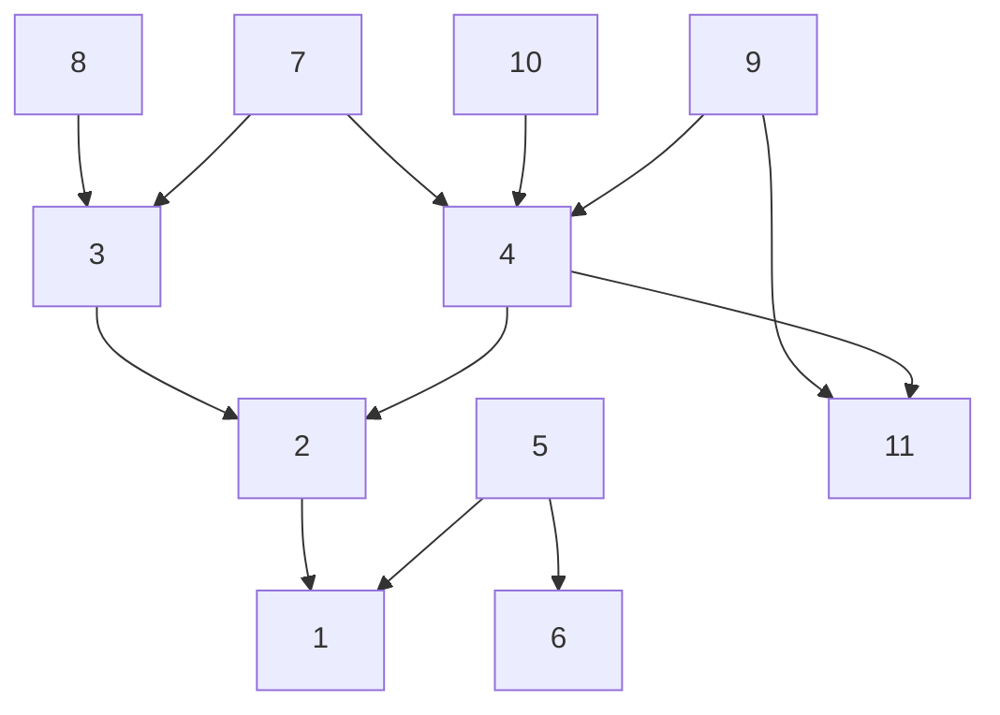
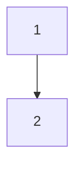
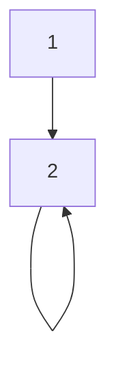
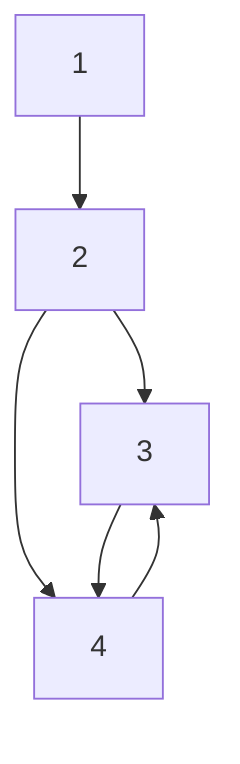
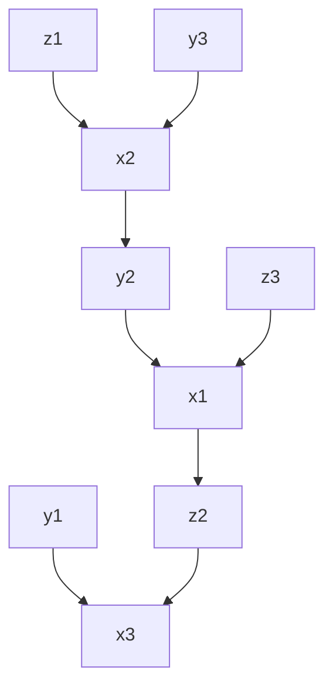

Now we start exploring the possibility of transform BUGS programs into sequential programs that compute the log density.
Here, as a start, we will try to answer the question: when can we generate sequential programs by simply reorder the statements.

To give a concrete example of the meaning of generating sequential program, with `Rats`

```julia
begin
    for i in 1:N
        for j in 1:T
            Y[i, j] ~ dnorm(mu[i, j], tau_c)              # (1)
            mu[i, j] = alpha[i] + beta[i] * (x[j] - xbar)  # (2)
        end
        alpha[i] ~ dnorm(alpha_c, alpha_tau)               # (3)
        beta[i] ~ dnorm(beta_c, beta_tau)                  # (4)
    end
    tau_c ~ dgamma(0.001, 0.001)                          # (5)
    sigma = 1 / sqrt(tau_c)                                # (6)
    alpha_c ~ dnorm(0.0, 1.0e-6)                           # (7)
    alpha_tau ~ dgamma(0.001, 0.001)                       # (8)
    beta_c ~ dnorm(0.0, 1.0e-6)                            # (9)
    beta_tau ~ dgamma(0.001, 0.001)                        # (10)
    alpha0 = alpha_c - xbar * beta_c                        # (11)
end
```

A sequential version would be 

```julia
begin
    tau_c ~ dgamma(0.001, 0.001)                           # (5)
    sigma = 1 / sqrt(tau_c)                                # (6)
    alpha_c ~ dnorm(0.0, 1.0e-6)                           # (7)
    alpha_tau ~ dgamma(0.001, 0.001)                       # (8)
    beta_c ~ dnorm(0.0, 1.0e-6)                            # (9)
    beta_tau ~ dgamma(0.001, 0.001)                        # (10)
    
    for i in 1:N
        alpha[i] ~ dnorm(alpha_c, alpha_tau)               # (3)
        beta[i] ~ dnorm(beta_c, beta_tau)                  # (4)
        
        for j in 1:T
            mu[i, j] = alpha[i] + beta[i] * (x[j] - xbar)  # (2)
            Y[i, j] ~ dnorm(mu[i, j], tau_c)               # (1)
        end
    end
    
    alpha0 = alpha_c - xbar * beta_c                       # (11)
end
```

Another equally valid one is

```julia
begin
    tau_c ~ dgamma(0.001, 0.001)                           # (5)
    sigma = 1 / sqrt(tau_c)                                # (6)
    alpha_c ~ dnorm(0.0, 1.0e-6)                           # (7)
    alpha_tau ~ dgamma(0.001, 0.001)                       # (8)
    beta_c ~ dnorm(0.0, 1.0e-6)                            # (9)
    beta_tau ~ dgamma(0.001, 0.001)                        # (10)
    
    for i in 1:N
        alpha[i] ~ dnorm(alpha_c, alpha_tau)               # (3)
    end

    for i in 1:N
        beta[i] ~ dnorm(beta_c, beta_tau)                  # (4)
    end

    for i in 1:N
        for j in 1:T
            mu[i, j] = alpha[i] + beta[i] * (x[j] - xbar)  # (2)
        end
    end
    
    for i in 1:N
        for j in 1:T    
            Y[i, j] ~ dnorm(mu[i, j], tau_c)               # (1)
        end
    end
    
    alpha0 = alpha_c - xbar * beta_c                        # (11)
end
```

All these program has the same semantic for BUGS. 
The difference is, when interpreting `~` as sampling, the latter two can run sequentially without encountering undefined variable problem.
I.e., sequential versions of BUGS program respect the dependencies and topological order of the variables in the graphical model.

To compute log density, we then need to further transform the sequential program.
The transform can be understood in terms of statement-wise transformation.

> It should be noted that stochastic statements and deterministic statements are not created equal because of the way the program is executed.
On a high level, the program defines a computation that takes values of model parameters, and returns the log density (log prior + log likelihood) of the model.
This means that even if the stochastic statements are not sorted, we can still produce correct results, by:
(1) first setting the values of the model parameters,
(2) executing the deterministic statements to decide the values of variables,
(3) go through all the stochastic statements, and compute the log density for each of them.
So if we all we care about is the log density, we only need to sort the deterministic statements.
However, if we want to able to do ancestral sampling (and simulation), we need to sort the stochastic statements.
Although not sorting the stochastic statements does not make the problem simpler fundamentally, in some cases, sorting the stochastic statements might be hard, while sorting the deterministic statements is trivial.

At this stage, we will not talk about performance optimization here, all we care about now is the correctness.

A good way to understand the dependencies and whether we are able to reorder statements, we will use a dependency graph of statements.
Here is a concrete example for when an edge exists:

```julia
for i in 1:N
    for j in 1:T
        Y[i, j] ~ dnorm(mu[i, j], tau_c)              # (1)
        mu[i, j] = alpha[i] + beta[i] * (x[j] - xbar)  # (2)
    end
end
```

upon loop unrolling, statement (1) will be unrolled into

```julia
Y[1, 1] ~ dnorm(mu[1, 1], tau_c)
Y[2, 2] ~ dnorm(mu[2, 2], tau_c)
...
```

statement (2) will be unrolled into

```
mu[1, 1] = alpha[1] + beta[1] * (x[1] - xbar)
...
```

we see that `mu[1, 1]` is used on the RHS in some statements unrolled out of statement (1).

Then the dependency graph contains edge (2) -> (1).

A naive algorithm to compute this dependency graph, after obtain the `BUGSGraph` is 

* step 1
  * build a `IdDict{Expr,Int}` (using `IdDict` because multiple same `Expr` can exist)
* step 2
  * using the `compiler_pass` pipeline to attribute each variable(node) in the `BUGSGraph` with a statement id
* step 3
  * initialize the dependency graph, the number of vertices in this graph is the number of statements
  * add edges
    * an edge exist between two statements `s1` and `s2` if there is an edge between `n1` and `n2` for any `n1` attributed to `s1` and `n2` attributed to `s2` 

This is a worst case $n^2$ algorithm where $n$ is the number of nodes in `BUGSGraph`, but because only an edge exist, we can terminate early, the runtime shouldn't be too bad.

For `rats`, we obtain this graph



The thing to note here is that there is no cycle in the dependency graph.

Later soon we will see some cases where there exist cycle(s) exist in dependency graph.

But before, let's make the meaning of an edge in the dependency graph more clear.

Consider example

```julia
for i in 1:N
    x[i] ~ normal(0, 1)     (1)
    y[i] ~ normal(x[N], i)  (2) 
end
```

the dependency graph in this case is very simple



Question is, can we run the above code?

The answer is no, because each `y[i]` require `x[N]` to compute.
And `x[N]` is computed at the end of the loop iteration.

In this case, we have to fission the loop, and the valid sequential program is

```julia
for i in 1:N
    x[i] ~ normal(0, 1)     (1)
end
for i in 1:N    
    y[i] ~ normal(x[N], i)  (2) 
end
```

The issue here is that `x[N]` is not known until the end of the loop.

The node represents all the computation results associated with a statement.
The edge means to compute some result of the terminal statement, it requires some result of the source statement.

## self loop: requires change of loop indexing

This is a rather contrived example.

```julia
x[1] ~ dnorm(0, 1)        # 1
for 10:2
    x[i] = x[i - 1] + 1    # 2
end
```

The issue is that `x[10]` depends on `x[9]` (`x[10] = x[9] + 1`), but if we execute the code as it is written, then when we want to compute `x[10]`, `x[9]` is not computed yet.

But this is valid BUGS code, because BUGS only care about relationship. 

To make this code sequential, it needs to be transformed to 

```julia
x[1] ~ dnorm(0, 1)        # 1
for 2:10
    x[i] = x[i - 1] + 1    # 2
end
```

i.e., simply change the order of iteration.

Note that the dependency graph has a self loop.



## Case 2: requires loop fusion

```julia
x[1] ~ dnorm(0, 1)  // 1
  
sumX[1] = x[1]  // 2
for i in 2:N
    sumX[i] = sumX[i-1] + x[i]  // 3
end

for i in 2:N
    x[i] ~ dnorm(sumX[i-1], tau)  // 4
end
```

The issue here is that there is a dependency between `x[i]` and `x[i-1]` via `sumX[i-1]`.
So we need to compute `x[i]` and `sumX[i-1]` (or `sumX[i]`) in the same loop iteration.

This may seem to be a an easy issue.
But it can be made more complicated in case where indices are affine transformation of loop induction variables. 

For instance,

```julia
sumX[1] = x[1]
for i in 2:N
    sumX[i] = sumX[i-1] + x[i]
end

# loop over even indices
for i in 1:N/2
    x[2*i] ~ dnorm(sumX[2*i-1], tau)
end

# loop over odd indices
for i in 1:N/2
    x[2*i + 1] ~ dgamma(sumX[2*i], tau)
end
```

then we would need to somehow merge the later two loops and the loop over `sumX`.

The dependency graph for here is 



## loops in dependency graph

At this point, we start to see that loops in the dependency graph can be problematic.

A loop exist when we can't finish all the computation belong to the same statement before start carrying out the computation of another statement.

## Introduction of nested indexing complicates things

They don't change the nature of the problem (which is about dependency).
But they can make the worst case really really bad.

Just consider

```julia
begin
    z[2] = f(x[1])
    y[2] = g(x[3])

    for i in 1:3
        x[i] = y[a[i]] + z[b[i]]
    end
end

data = (a = [2, 3, 1], b = [3, 1, 2])
```

this results in the following dependencies

```julia
x[1] <- y[2], z[3]
x[2] <- y[3], z[1]
x[3] <- y[1], z[2]
z[2] <- x[1]
y[2] <- x[2]
```



This represents a worst case where we probably can't do much better than fully unrolling.

---

trying to get a grander and unified story behind  

question: when can we switch the order of statements and be fine


## the hard work: BUGS examples, how many of them we can trivially reorder?


Why going beyond the trivial case is difficult?
The indices might be misaligned
Loop 1 (x) starts from 1, loop 2 (x) start from 2
But x[1] depends on y[1], so we need to single out x[1]
Sometimes, off by 1(or N)
If some indices are affine transformation, matching them can be really hard


