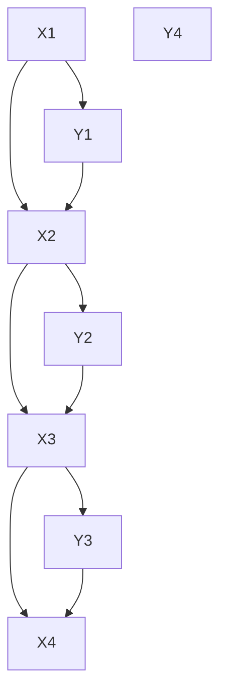

# Transform BUGS to sequential program

let’s start with a simple state-space model with mutual dependency

```julia
x[1] = 0
for i in 1:3
	x[i+1] = alpha * x[i] + beta * y[i]
	y[i] ~ dnorm(x[i], 1)
end
y[4] = 1 
```

the following program is equally viable

```julia
x[1] = 0
for i in 2:4
	x[i] = alpha * x[i-1] + beta * y[i-1]
end
for i in 1:3
	y[i] ~ dnorm(x[i], 1)
end
y[4] = 1 
```

I want to recover the loop structure

the algorithm

1. name the statement

```julia
(1) x[1] = 0 
for i in 2:4
(2)	x[i] = alpha * x[i-1] + beta * y[i-1]
end

for i in 1:3
(3)	y[i] ~ dnorm(x[i], 1)
end
(4) y[4] = 1 
```

1. decide which array element from which statement

```julia
x = [1, 2, 2, 2]
y = [3, 3, 3, 4]
```

also the indices, this is important for loop reconstruction

```julia
dim1:
x = [don't care, 2, 3, 4] 

y = [1, 2, 3, don't care]
```

1. build the graph

**it is important that variables in the same loop has consecutive numbering** 

```julia
x[1] -> 1
x[2] -> 2
x[3] -> 3
x[4] -> 4

y[1] -> 5
y[2] -> 6
y[3] -> 7
y[4] -> 8
```



1. topological sort

`[8, 1, 5, 2, 6, 3, 7, 4]` : topological sort will by default follow number order
2. map the statement id to the sort
    
    `[4, 1, 3, 2, 3, 2, 3, 2, 3]` : now we see the pattern
    
3. sliding window algorithm to detect pattern
    
    the idea is to find the most repeated subsequence and put them in a loop if we are lucky
    
4. the “if we are lucky part”: loop formation
    
    in this example, we know the pattern is `[2, 3]`
    
    look at node `5` : `y[1]` `2`: `x[2]`
    
    `6`: `y[2]` `3` : `x[3]` 
    
    the ideal loop code
    
    ```julia
    # order doesn't matter
    y[4] = 1
    x[1] = 0
    
    for i in 1:3
    	y[i] ...
    	x[i+1] ...
    end
    ```